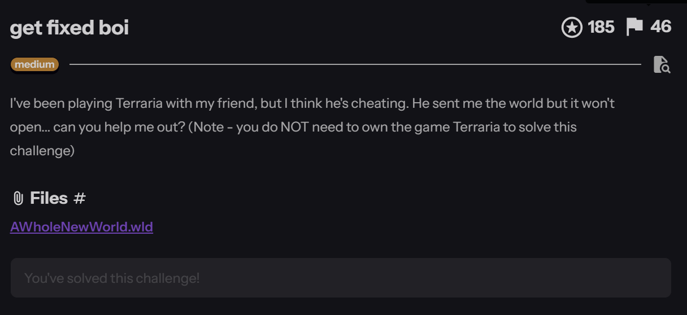
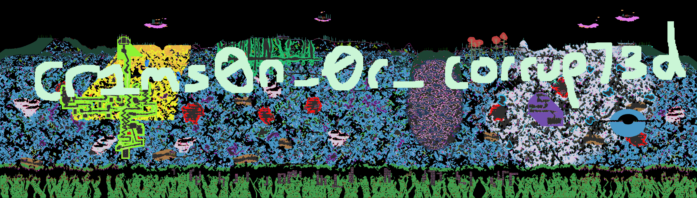

# Get fixed boi

**`K17{cr1ms0n_0r_corrup73d}`**

&nbsp;

**Category**: Forensic



**Resource Provided**
- **File**: `AWholeNewWorld.wld` — a Terraria world save

The prompt: "I've been playing Terraria with my friend, but I think he's cheating. He sent me the world but it won't open… can you help me out? (you do NOT need to own the game.)"

Translation: Here's a save file that refuses to load. The flag isn't a string you can grep — it's **painted into the world in blocks**, and to see it you first have to un-break the file. Hence the title: get fixed, boi.

---

&nbsp;

## First look

`file` doesn't know it, but the extension and the contents give it away: it's a Terraria `.wld` save, 2.7 MB. Two quick facts settle what we're dealing with:

- Buried in the file is a JSON blob ending `"Version":"v1.4.5.6"` — so it's a modern (1.4.x) world.
- `grep` for `K17`, `flag`, reversed, upper/lower — `nothing`. The flag is not stored as text.

If it's not text, and the challenge is about a world that "won't open", the flag is almost certainly built out of tiles — you're meant to repair the file, render the map, and read it. So step one is figuring out why it won't load.

&nbsp;

## Why it won't open

Every Terraria world from 1.3 onwards begins with a fixed header. The layout (little-endian) is:

| offset | field | expected |
|---|---|---|
| `0x00` | `int32` version | `319` (1.4.x) |
| `0x04` | `char[7]` magic | **`"relogic"`** |
| `0x0B` | `byte` fileType | `0x02` (= world) |
| `0x0C` | `uint32` revision | — |
| `0x10` | `uint64` favorite | — |
| `0x18` | `int16` section count | `11` |
| `0x1A` | `int32[]` section pointers | first points at the header section |

The very first thing the loader checks is that 7-byte `"relogic"` signature. In this file:

```
00000000: 3f01 0000 0000 0000 0000 0003 0400 0000
                    ^^^^^^^^^^^^^^^^^^^^^ should be "relogic\x02"
00000010: 0000 0000 0000 0000 0b00 c6c8 9b4f ....
                              cnt  ^^^^^^^^^ first section pointer
```

Two things are deliberately smashed:

1. **The magic is gone.** Bytes `0x04–0x0B` — which must read `relogic` + fileType `0x02` — are zeroed-out garbage. Terraria (and TEdit, and every world parser) checks this first and bails immediately. This one byte-range is the whole "won't open".
2. **The first section pointer is nonsense.** The `int32` at `0x1A` reads `0x4F9BC8C6` — an offset of ~1.3 GB into a 2.7 MB file. Even if you fixed the magic, the parser would then jump off the end of the file and die. The section pointers are a little table of "the header starts *here*, the tiles start *there*, the chests *there…*"; corrupting the first one breaks the map of the whole file.

&nbsp;

## The fix

Two surgical writes, both verifiable against the format:

```
import struct
d = bytearray(open("AWholeNewWorld.wld", "rb").read())

d[0x04:0x0C] = b"relogic\x02"          # restore magic "relogic" + fileType 0x02
struct.pack_into("<i", d, 0x1A, 0xA7)  # first section pointer -> 0xA7 (header start)

open("AWholeNewWorld-fixed.wld", "wb").write(d)
```

Why `0xA7`? Because that's where the header section actually begins, and the proof is immediate — parse from there and the fields line up perfectly:

```
@0xA7  world name  : "crimson"
       seed        : "1192594496"
```

The world is literally named `crimson` — which, given the flag, is the setter waving at you. Once these two writes are in, the file is a valid `v1.4.5.6` world again and any reader will open it.

&nbsp;

## Rendering the flag

With the header repaired you have two roads:

- `TEdit` (the community world editor) opens `AWholeNewWorld-fixed.wld` directly, and you can pan around the map.
- Or skip the GUI entirely: the section pointers now tell you exactly where the tile data lives, so a few dozen lines of tile-parsing will walk the `4200 × 1200` tile grid and dump each block's colour to a PNG.

Either way, the same thing jumps out — across the surface, in giant letters made of coloured blocks:



`corrup73d` is just leet for "corrupted" (`7→t, 3→e`), and "crimson or corrupted" is a Terraria pun — the two evil biomes a world can spawn with.

&nbsp;

## Reflection

The trick to this one is not being spooked by the file type. A 2.7 MB game save looks scary, but you don't need to know Terraria at all — you need to know that a file format has a header, and that a header has an anatomy you can look up. Once you accept "won't open" as a diagnosis rather than a dead end, the whole thing is two edits: restore the magic bytes so the parser trusts the file, and fix the one pointer that maps out where everything lives. The world data was pristine the entire time; the setter only tore out the table of contents. Repair the map, render the world, and the answer is spray-painted across the sky.