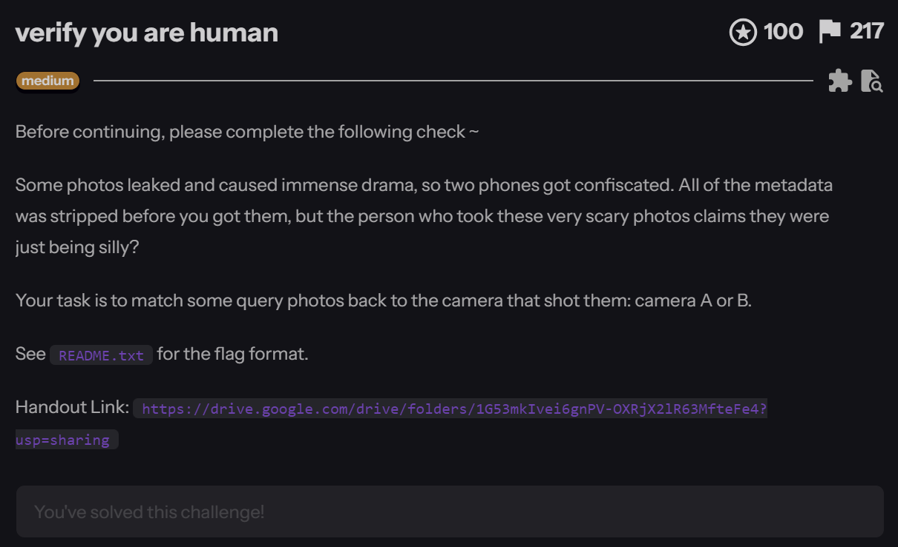
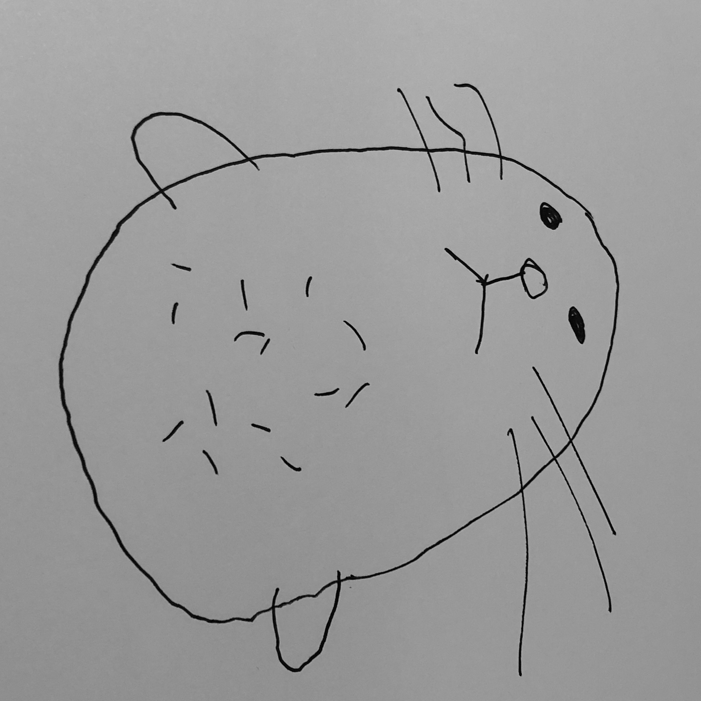
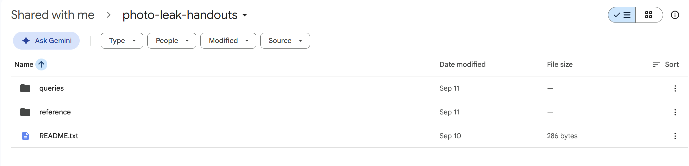
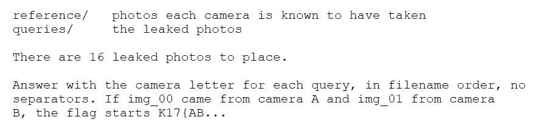
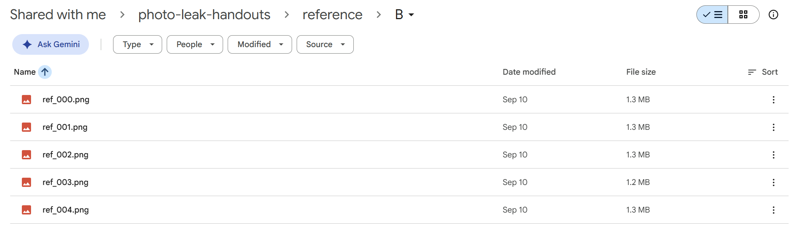
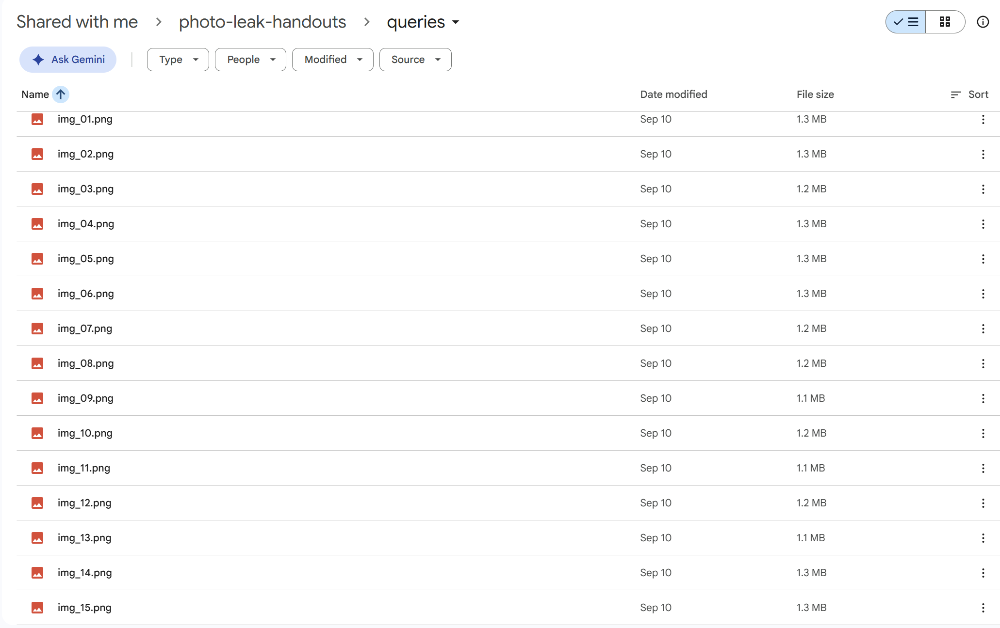
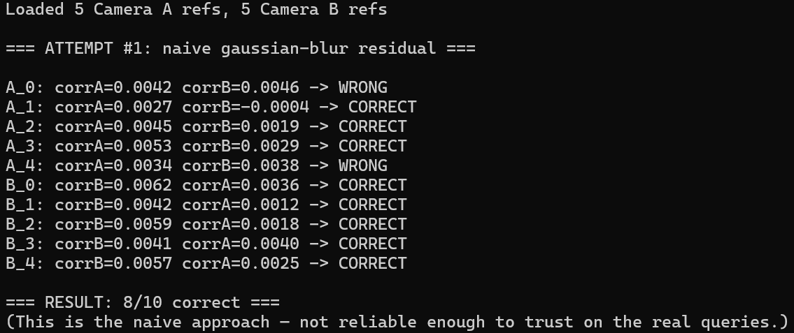
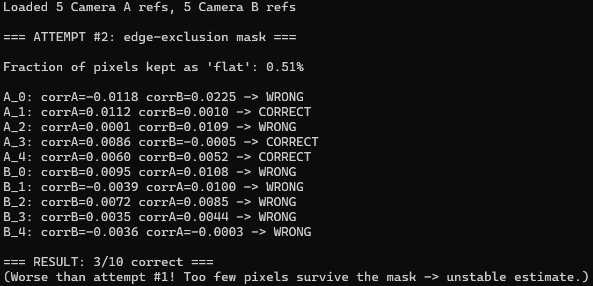
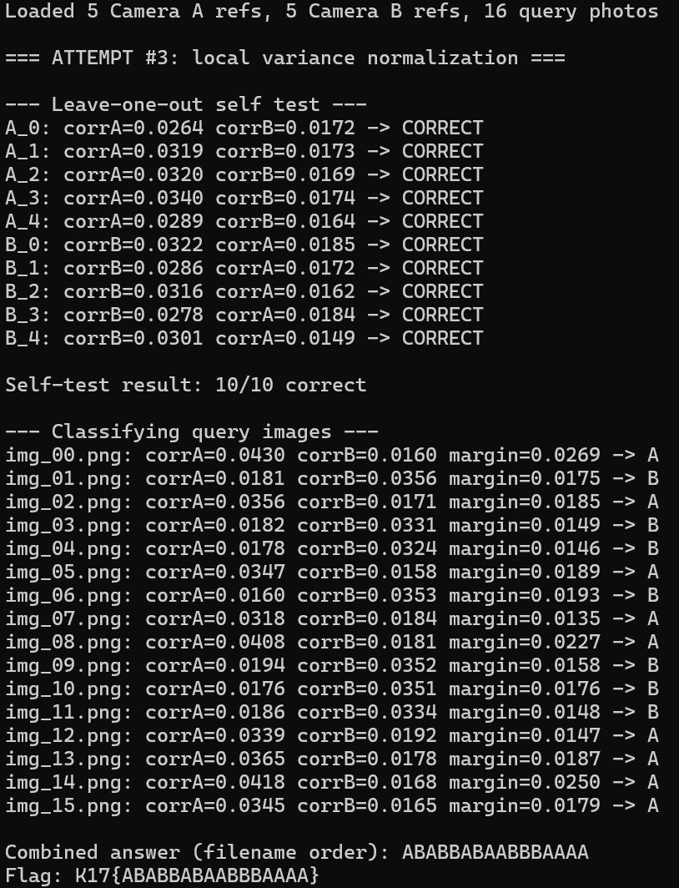

# Verify you are human

**`K17{ABABBABAABBBAAAA}`**

&nbsp;

**Category**: Misc



**Resource Provided**
- **Handout Link**: `https://drive.google.com/drive/folders/1G53mkIvei6gnPV-OXRjX2lR63MfteFe4?usp=sharing` — contains `referenceA`, `referenceB` (5 known photos per camera) and `queries` (16 leaked photos to classify)

Previously: Some "photos leaked and caused immense drama", and two phones got confiscated — Camera A and Camera B. All the metadata was stripped before we got the files, but the person who took these "very scary photos" claims they were just being silly.

Our job: 16 leaked photos, and for each one we need to figure out whether it came from Camera A or Camera B.

Sounds dramatic, right? So I opened the zip expecting... I don't know, crime scene stuff?



It's a hand-drawn doodle of a capybara. Or a hamster. Honestly not 100% sure what animal this is supposed to be. This is the "very scary photo". Whoever wrote this challenge has a great sense of humor.

---

&nbsp;

## Okay but what's actually being tested here

The handout looks like this:



- README



- Camera A


- Camera B



- Queries



All 2048x2048 grayscale PNGs. And here's the important part — every single photo, reference or query, is basically the same doodle, just shot from slightly different angles or positions. Same drawing style, same rough composition, every time.

That's not an accident. It's the whole point. If you try to eyeball the content or match pixels directly, you get nowhere, because the content is deliberately near-identical across every photo. Metadata's gone, content's useless — the only thing left that could actually tell two cameras apart is something baked into the sensor itself, invisible to the naked eye.

Which means this is a PRNU challenge. PRNU stands for Photo Response Non-Uniformity — basically, every camera sensor has tiny manufacturing imperfections that leave a unique, imperceptible noise pattern on every photo it takes. That pattern has nothing to do with what's being photographed. It's tied to the physical sensor. So two completely different photos, same camera, same fingerprint.

Plan:

1. Extract each camera's "fingerprint" from its 5 reference photos
2. Extract the same kind of noise from the 16 query photos
3. Correlate each query's noise against fingerprint A and fingerprint B, whichever is higher wins

&nbsp;

## Attempt 1: the naive version

Simplest possible idea — `noise = original image − blurred version of the image`. Gaussian blur keeps the low-frequency "content", subtracting it leaves the high-frequency stuff, which is where the sensor noise is most likely hiding.

```
def noise_residual(img, sigma=1.5):
    denoised = gaussian_filter(img, sigma=sigma)
    return img - denoised
```

Average the noise from the 5 reference photos per camera to get a "fingerprint", then run a `leave-one-out sanity check`: take one of Camera A's own reference photos, build a fingerprint from the `other four`, and see if it actually correlates higher with A than with B.



Result: `8 out of 10 correct`. Not terrible, but two wrong answers means something's leaking.

&nbsp;

## Attempt 2: I thought I was being clever

My reasoning at the time: the drawings are basically thick black lines on paper, and the edges of those lines are also "high frequency" — so they're probably getting mixed into my noise residual and polluting the fingerprint. If I just exclude any pixels near a drawn line and only look at the blank paper background, the signal should be much cleaner.

So I ran a Sobel edge detector, dilated the edges outward a bit to be safe, and only used the leftover "flat" pixels for correlation.



Result: `3 out of 10`. Worse than a coin flip.

In hindsight the problem is obvious — after excluding everything near a line, I was left with something like `0.5% of the total pixels`. That's nowhere near enough data for a stable correlation estimate. I basically engineered my own failure by being too aggressive. This is probably my favorite part of the whole solve because it's such a clean example of "sounded smart in my head, immediately backfired in practice."

&nbsp;

## Attempt 3: local variance normalization actually works

Instead of hard-excluding pixels, I switched to something gentler that's actually standard in real PRNU pipelines: `local variance normalization`. Near a drawn line, the noise residual naturally has higher local variance (because scene content is leaking in). So instead of throwing those pixels away entirely, just divide by that local variance — high-variance (line-adjacent) regions get suppressed, low-variance (genuinely flat, noise-only) regions keep their full weight. No pixels get deleted, but the scene content gets dampened automatically.

```
def local_variance_normalize(res, win=11, eps=0.5):
    local_mean = uniform_filter(res, size=win)
    local_sqmean = uniform_filter(res**2, size=win)
    local_var = np.maximum(local_sqmean - local_mean**2, 0)
    local_std = np.sqrt(local_var) + eps
    return res / local_std
```

Small extra step: subtract the row-mean and column-mean from the residual (`zero_mean`) to strip out any fixed row/column bias the sensor might have, which just makes the comparison a bit cleaner.



Ran the leave-one-out test again: `10 out of 10`, and the correlation gap between "right camera" and "wrong camera" was noticeably wider than before too. Genuinely satisfying moment — I was fully expecting to be stuck on this for a while.

&nbsp;

## Tightening the margin

10/10 was already passing, but the margin between camera A and camera B scores was still on the thin side, so I did a small grid search over blur strength, window size, and the epsilon that prevents division by zero (using downsampled images to keep it fast):

```
sigma=3.5, win=11, eps=0.5  →  min margin went from ~0.006 to ~0.014+
```

Re-ran the leave-one-out check at full resolution with these settings just to be sure downsampling hadn't skewed anything: still 10/10, with every individual margin comfortably above 0.009. That's a strong enough gap that I'm confident this isn't just getting lucky.

&nbsp;

## Classifying the 16 queries

Built the final camera fingerprints using all 5 reference photos per camera (no more holding anything out), then ran all 16 query photos through the same pipeline:

| Photo | Result | Photo | Result |
|---|---|---|---|
| img_00 | A | img_08 | A |
| img_01 | B | img_09 | B |
| img_02 | A | img_10 | B |
| img_03 | B | img_11 | B |
| img_04 | B | img_12 | A |
| img_05 | A | img_13 | A |
| img_06 | B | img_14 | A |
| img_07 | A | img_15 | A |

Every single query had a margin somewhere between 0.013 and 0.027 — no ambiguous borderline cases, which was reassuring.

Reading off img_00 through img_15 in order:
```
ABABBABAABBBAAAA
```

Hooray! Get the Flag!

&nbsp;

## Reflection

Not gonna lie, seeing "all metadata stripped" in the description made me a little nervous at first — no EXIF, so what am I even supposed to look at? Then I opened the files and saw sixteen nearly-identical doodles, which made it worse, because that killed off any hope of just eyeballing the content for clues.

Looking back at attempt 2 (the edge-exclusion thing), it's kind of embarrassing, but at the time I genuinely thought I'd found a clever optimization. Getting 3/10 — worse than a coin flip — was a real "wait, what" moment. It took me a minute to realize I'd thrown away 99.5% of the usable pixels and was basically trying to do statistics on a handful of grains of sand.

The local variance normalization fix wasn't some brilliant insight on my part, honestly. I just went and read a bit about how real PRNU pipelines handle this, saw that soft-weighting instead of hard-excluding is basically the standard move, tried it, and got 10/10 first try. Genuinely surprised — I'd mentally prepared to be stuck on this for way longer.

Writing this up afterward, the thing that stuck with me most isn't really about the technique itself. It's that you don't need to already know PRNU forensics to get somewhere — you just need to be willing to look things up, try something, watch it fail, and actually think about why it failed instead of just tweaking numbers blindly. Also, mildly unsettling realization: "we deleted the metadata" is not actually enough to make a photo untraceable. That's a little more real-world-relevant than I expected from a CTF challenge.

&nbsp;

## Appendix: The Three Attempts (Full Code)

**Attempt 1**
```
import numpy as np
from PIL import Image
from scipy.ndimage import gaussian_filter
import glob


def load(path):
    return np.array(Image.open(path).convert('L'), dtype=np.float64)


def noise_residual(img, sigma=1.5):
    """noise = original - blurred(original)"""
    denoised = gaussian_filter(img, sigma=sigma)
    return img - denoised


def zero_mean(res):
    res = res - res.mean(axis=0, keepdims=True)
    res = res - res.mean(axis=1, keepdims=True)
    return res


def pipeline(img):
    r = noise_residual(img)
    r = zero_mean(r)
    return r


def corr(a, b):
    a = a.flatten() - a.mean()
    b = b.flatten() - b.mean()
    return float(np.dot(a, b) / (np.linalg.norm(a) * np.linalg.norm(b)))


def main():
    ref_a = sorted(glob.glob('reference/A/*.png')) or sorted(glob.glob('reference/reference/A/*.png'))
    ref_b = sorted(glob.glob('reference/B/*.png')) or sorted(glob.glob('reference/reference/B/*.png'))

    print(f"Loaded {len(ref_a)} Camera A refs, {len(ref_b)} Camera B refs\n")
    print("=== ATTEMPT #1: naive gaussian-blur residual ===\n")

    res_a = [pipeline(load(p)) for p in ref_a]
    res_b = [pipeline(load(p)) for p in ref_b]

    correct = 0
    total = 0

    for i in range(len(res_a)):
        fp_a_loo = np.mean([res_a[j] for j in range(len(res_a)) if j != i], axis=0)
        fp_b_full = np.mean(res_b, axis=0)
        c_a = corr(res_a[i], fp_a_loo)
        c_b = corr(res_a[i], fp_b_full)
        ok = c_a > c_b
        correct += ok
        total += 1
        print(f"A_{i}: corrA={c_a:.4f} corrB={c_b:.4f} -> {'CORRECT' if ok else 'WRONG'}")

    for i in range(len(res_b)):
        fp_b_loo = np.mean([res_b[j] for j in range(len(res_b)) if j != i], axis=0)
        fp_a_full = np.mean(res_a, axis=0)
        c_b = corr(res_b[i], fp_b_loo)
        c_a = corr(res_b[i], fp_a_full)
        ok = c_b > c_a
        correct += ok
        total += 1
        print(f"B_{i}: corrB={c_b:.4f} corrA={c_a:.4f} -> {'CORRECT' if ok else 'WRONG'}")

    print(f"\n=== RESULT: {correct}/{total} correct ===")
    print("(This is the naive approach — not reliable enough to trust on the real queries.)")


if __name__ == '__main__':
    main()
```

**Attempt 2**
```
import numpy as np
from PIL import Image
from scipy.ndimage import gaussian_filter, sobel, binary_dilation
import glob


def load(path):
    return np.array(Image.open(path).convert('L'), dtype=np.float64)


def noise_residual(img, sigma=1.5):
    denoised = gaussian_filter(img, sigma=sigma)
    return img - denoised


def zero_mean(res):
    res = res - res.mean(axis=0, keepdims=True)
    res = res - res.mean(axis=1, keepdims=True)
    return res


def flat_mask(img, grad_thresh=8, dilate_iter=4):
    """True where the pixel is 'flat' (far from any drawn line)."""
    gx = sobel(img, axis=0)
    gy = sobel(img, axis=1)
    grad = np.hypot(gx, gy)
    edge = grad > grad_thresh
    edge_dilated = binary_dilation(edge, iterations=dilate_iter)
    return ~edge_dilated


def pipeline(img):
    r = noise_residual(img)
    r = zero_mean(r)
    return r


def corr_masked(a, b, mask):
    a = a[mask] - a[mask].mean()
    b = b[mask] - b[mask].mean()
    return float(np.dot(a, b) / (np.linalg.norm(a) * np.linalg.norm(b)))


def main():
    ref_a = sorted(glob.glob('reference/A/*.png')) or sorted(glob.glob('reference/reference/A/*.png'))
    ref_b = sorted(glob.glob('reference/B/*.png')) or sorted(glob.glob('reference/reference/B/*.png'))

    print(f"Loaded {len(ref_a)} Camera A refs, {len(ref_b)} Camera B refs\n")
    print("=== ATTEMPT #2: edge-exclusion mask ===\n")

    imgs_a = [load(p) for p in ref_a]
    imgs_b = [load(p) for p in ref_b]
    res_a = [pipeline(im) for im in imgs_a]
    res_b = [pipeline(im) for im in imgs_b]
    mask_a = [flat_mask(im) for im in imgs_a]
    mask_b = [flat_mask(im) for im in imgs_b]

    print(f"Fraction of pixels kept as 'flat': {mask_a[0].mean() * 100:.2f}%\n")

    correct = 0
    total = 0

    for i in range(len(res_a)):
        fp_a_loo = np.mean([res_a[j] for j in range(len(res_a)) if j != i], axis=0)
        fp_b_full = np.mean(res_b, axis=0)
        m = mask_a[i]
        c_a = corr_masked(res_a[i], fp_a_loo, m)
        c_b = corr_masked(res_a[i], fp_b_full, m)
        ok = c_a > c_b
        correct += ok
        total += 1
        print(f"A_{i}: corrA={c_a:.4f} corrB={c_b:.4f} -> {'CORRECT' if ok else 'WRONG'}")

    for i in range(len(res_b)):
        fp_b_loo = np.mean([res_b[j] for j in range(len(res_b)) if j != i], axis=0)
        fp_a_full = np.mean(res_a, axis=0)
        m = mask_b[i]
        c_b = corr_masked(res_b[i], fp_b_loo, m)
        c_a = corr_masked(res_b[i], fp_a_full, m)
        ok = c_b > c_a
        correct += ok
        total += 1
        print(f"B_{i}: corrB={c_b:.4f} corrA={c_a:.4f} -> {'CORRECT' if ok else 'WRONG'}")

    print(f"\n=== RESULT: {correct}/{total} correct ===")
    print("(Worse than attempt #1! Too few pixels survive the mask -> unstable estimate.)")


if __name__ == '__main__':
    main()
```

**Attempt 3**
```
import numpy as np
from PIL import Image
from scipy.ndimage import gaussian_filter, uniform_filter
import glob
import os

# Tuned parameters (found via grid search)
SIGMA = 3.5   # gaussian blur strength for the low-pass "content" estimate
WIN = 11      # window size for local variance estimation
EPS = 0.5     # small constant to avoid division by zero


def load(path):
    return np.array(Image.open(path).convert('L'), dtype=np.float64)


def noise_residual(img, sigma=SIGMA):
    """noise = original - blurred(original)"""
    denoised = gaussian_filter(img, sigma=sigma)
    return img - denoised


def local_variance_normalize(res, win=WIN, eps=EPS):
    """
    Divide the residual by its local standard deviation.
    Near scene edges, local variance is naturally high, so those
    regions get suppressed. Flat, noise-only regions keep their
    full weight. No pixels are deleted.
    """
    local_mean = uniform_filter(res, size=win)
    local_sqmean = uniform_filter(res ** 2, size=win)
    local_var = np.maximum(local_sqmean - local_mean ** 2, 0)
    local_std = np.sqrt(local_var) + eps
    return res / local_std


def zero_mean(res):
    """Remove fixed row/column offsets (common sensor artifact)."""
    res = res - res.mean(axis=0, keepdims=True)
    res = res - res.mean(axis=1, keepdims=True)
    return res


def pipeline(img):
    r = noise_residual(img)
    r = local_variance_normalize(r)
    r = zero_mean(r)
    return r


def corr(a, b):
    a = a.flatten() - a.mean()
    b = b.flatten() - b.mean()
    return float(np.dot(a, b) / (np.linalg.norm(a) * np.linalg.norm(b)))


def main():
    ref_a_paths = sorted(glob.glob('reference/A/*.png')) or sorted(glob.glob('reference/reference/A/*.png'))
    ref_b_paths = sorted(glob.glob('reference/B/*.png')) or sorted(glob.glob('reference/reference/B/*.png'))
    query_paths = sorted(glob.glob('queries/*.png')) or sorted(glob.glob('queries/queries/*.png'))

    if not ref_a_paths or not ref_b_paths:
        print("Could not find reference images. Check your folder structure.")
        return

    print(f"Loaded {len(ref_a_paths)} Camera A refs, {len(ref_b_paths)} Camera B refs, "
          f"{len(query_paths)} query photos\n")
    print("=== ATTEMPT #3: local variance normalization ===\n")

    res_a = [pipeline(load(p)) for p in ref_a_paths]
    res_b = [pipeline(load(p)) for p in ref_b_paths]

    print("--- Leave-one-out self test ---")
    correct = 0
    total = 0
    for i in range(len(res_a)):
        fp_a_loo = np.mean([res_a[j] for j in range(len(res_a)) if j != i], axis=0)
        fp_b_full = np.mean(res_b, axis=0)
        c_a = corr(res_a[i], fp_a_loo)
        c_b = corr(res_a[i], fp_b_full)
        ok = c_a > c_b
        correct += ok
        total += 1
        print(f"A_{i}: corrA={c_a:.4f} corrB={c_b:.4f} -> {'CORRECT' if ok else 'WRONG'}")

    for i in range(len(res_b)):
        fp_b_loo = np.mean([res_b[j] for j in range(len(res_b)) if j != i], axis=0)
        fp_a_full = np.mean(res_a, axis=0)
        c_b = corr(res_b[i], fp_b_loo)
        c_a = corr(res_b[i], fp_a_full)
        ok = c_b > c_a
        correct += ok
        total += 1
        print(f"B_{i}: corrB={c_b:.4f} corrA={c_a:.4f} -> {'CORRECT' if ok else 'WRONG'}")

    print(f"\nSelf-test result: {correct}/{total} correct\n")

    if not query_paths:
        print("(No queries/ folder found — skipping final classification.)")
        return

    # Build final fingerprints from ALL reference photos (no holding out)
    fingerprint_a = np.mean(res_a, axis=0)
    fingerprint_b = np.mean(res_b, axis=0)

    print("--- Classifying query images ---")
    answer_letters = []
    for qp in query_paths:
        q_res = pipeline(load(qp))
        c_a = corr(q_res, fingerprint_a)
        c_b = corr(q_res, fingerprint_b)
        label = 'A' if c_a > c_b else 'B'
        answer_letters.append(label)
        name = os.path.basename(qp)
        print(f"{name}: corrA={c_a:.4f} corrB={c_b:.4f} margin={abs(c_a - c_b):.4f} -> {label}")

    flag_content = ''.join(answer_letters)
    print(f"\nCombined answer (filename order): {flag_content}")
    print(f"Flag: K17{{{flag_content}}}")


if __name__ == '__main__':
    main()
```