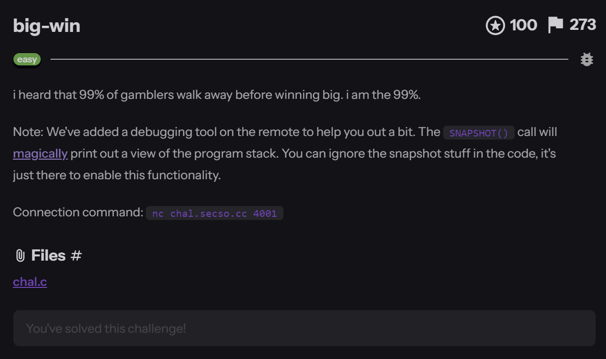
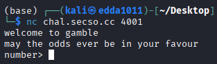
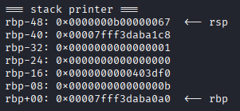
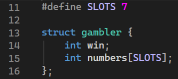
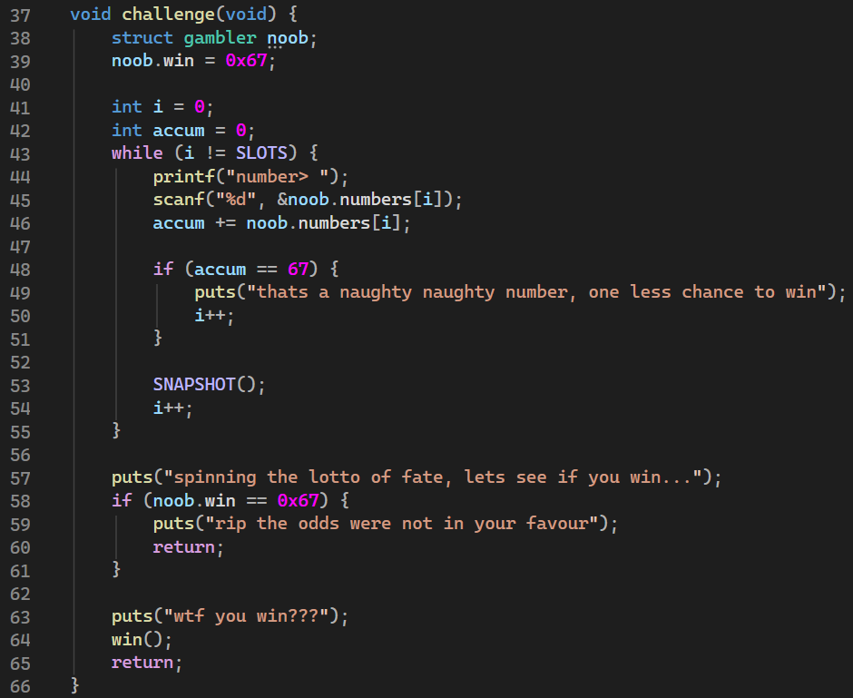
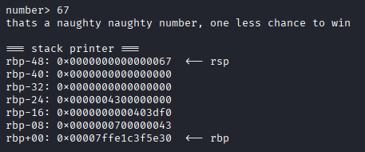
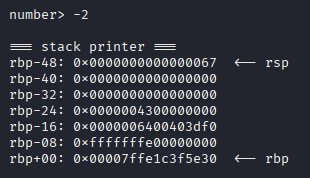
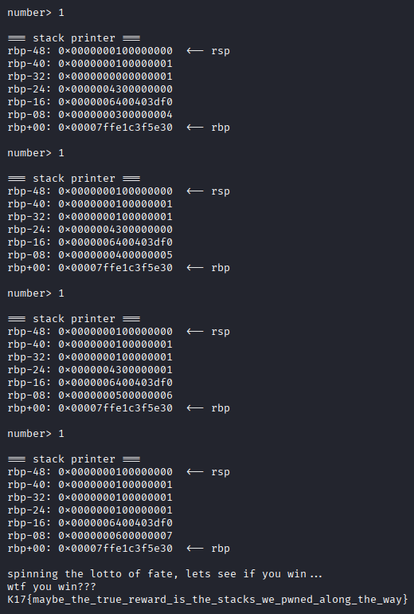

# Big-win

**`K17{maybe_the_true_reward_is_the_stacks_we_pwned_along_the_way}`**

&nbsp;

**Category**: Pwn (Honestly it's more of a logic puzzle)



**Resource Provided**
- **Source code**: `chal.c` — the vulnerable program
- **URL**: `https://man7.org/linux/man-pages/man2/ptrace.2.html` — explains the ptrace syscall behind the built-in stack printer
- **Connection Command**: `nc chal.secso.cc 4001`

Previously: No reversing, No libc leak, No ROP. The whole thing is one `scanf` whose index you can quietly steer. Walk that index into the negatives and you write straight back over `win`. There's also a ptrace man page in the handout. When I first opened it, I was taken aback and I was thinking, ‘Isn’t this a easy challenge? Why does it look so complicated?’ It wasn’t until later that I realised the setter was worried we might be too daft to understand it, so they’d manually ‘cheated’ for us.

---

&nbsp;

## Let’s connect first and see

Once you’ve clicked through, you’ll see this:



It then asks you to keep entering numbers, and every time you enter one, it prints out a chunk of the stack:



This bit of information will come in very handy later on, so do bear it in mind. If you’d like to find out more, you can click on the URL link above to read the content.

&nbsp;

## Explore the source code

`chal.c` is neither long nor complex, just two part matter.
#### **First Part - Structure**



`win` is declared before `numbers`. In C, struct members sit in declaration order, and an `int` is 4 bytes, so in memory it looks like:
`[ win ][ numbers[0] ][ numbers[1] ] ... [ numbers[6] ]`

Which means `win` is equal to `numbers[-1]`. This equation is the key to the whole challenge.
#### **Second Part - Game Loop**



As you can see, `win` starts at **0x67**. To obtain the flag, you must ensure that, at the end of the loop, `win ≠ 0x67`. That's the only goal: change `win` to literally anything else.

&nbsp;

## Where is the vulnerability?

The program writes to memory in exactly one place: `scanf("%d", &noob.numbers[i])`. Where it writes is decided by i.

So... can I make `i = -1`? If I can, that scanf writes right into win (since `win == numbers[-1]`).

Problem is `i` starts at 0 and only ever `+1s`, so normally it never goes negative. Two things fix that:

1. **The loop condition is `i != 7`, not** `i < 7`. So if I can make `i` **skip over 7**, the loop never stops, and scanf becomes an out-of-bounds write with an index I control.

2. **The `accum == 67` branch does an extra** `i++`. If I line it up so accum equals 67 on the `i = 6` iteration, `i` goes `6 → 7 (extra) → 8 (normal)` — one clean jump past 7. After that `i` marches 8, 9, 10 straight off the end of the array.

And if `i` can write past the end... can it write over `i` itself? If so, I just set `i` to whatever I want.

&nbsp;

## Key Part!! Which stack slot is which variable

`i`and `accum` are locals, so the compiler parks them on the stack right after `noob`. Which `numbers[?]` they line up with depends on the actual layout.

Normally this is where you'd fire up gdb, or rebuild locally with `-DENABLE_SNAPSHOT` (that macro in the source is literally `asm volatile("int3")`) and read the layout off a breakpoint. But here you **don't have to** — that `═══ stack printer ═══` is already shoving the stack in your face.

Which is what the ptrace man page in the handout is about. `ptrace(2)` is Linux's process-tracing syscall; the man page spells it out — one process gets to observe and control another and read its registers and memory. The setter wrapped the vulnerable process in exactly that: every round it hits the `int3` in `SNAPSHOT()` and stops (SIGTRAP), and an outer tracer uses ptrace to read around `rbp` and print it. That's your stack printer.

So the setter isn't making you debug it yourself — he ptraced it for you and hands you the stack. Fine, let's read it.



Each 8-byte slot is holding two `ints`. Look at `rbp-08`: low 32 bits `0x43 = 67` is **accum**, high 32 bits `0x07 = 7` is **i**. Those two are neighbours.

Counting up from `numbers[0]` (it's at `rbp-44`, **one every 4 bytes**), `accum` lands in the low half of `rbp-08` = `numbers[9]`, and `i` in its high half = `numbers[10]`.

Hooray! So now I've got three coordinates:

- `win = numbers[-1]`
- `accum = numbers[9]`
- `i = numbers[10]`

That's everything I need to derive the inputs.

&nbsp;

## Deriving the inputs

With those three coordinates, just walk the loop by hand and ask each round "what does this write, and what do I want there":
| Round `i` | scanf writes | goal | input |
|---|---|---|---|
| 0-5 | numbers[0..5] | keep accum at 0, don't trigger early | `0` ×6 |
| 6 | numbers[6] | make accum 67 → the extra i++ jumps `i` from 6 to 8 | `67` |
| 8 | numbers[8] | junk slot, anything | `100` |
| 9 | numbers[9]=accum | scanf sets accum to 0, `accum += 0` stays 0 — clears it so it can't hit 67 again | `0` |
| 10 | numbers[10]=`i` itself | set `i` to -2; the loop's trailing `i++` makes it **-1** | `-2` |
| -1 | numbers[-1]=`win` | overwrite it! any non-0x67 value | `0` |
| 0-6 | numbers[0..6] | `i` is back at 0, feed 7 values to walk it up to 7 and exit | `1` ×7 |

Two gotchas:

- Why `-2` and not `-1`? Because after writing `i = -2`, that same round still runs one more `i++`, so `-2 + 1 = -1`. You have to aim one short.
- Why the trailing `1s`? Once `win` is changed, `i` is back at 0, so it needs to `+1` its way up to 7 to leave the loop — and those values must not push accum back to 67. `1` is safe.

The fun bit is watching the stack dump confirm each step.

Sending `-2`, the high half of `rbp-08` becomes `0xfffffffe`:



Next round I send `0`, and the trailing `i++` pushes `i` to `-1`:
`rbp-08: 0xffffffff00000000   ← i = -1`

...and that round's scanf writes into `numbers[-1]` = `win`. Scroll back up to `rbp-48` and you can see `win` flip from `0x...067` to `0x...000`. Done.

&nbsp;

## Wrapping up

`win` is 0 now, a few `1s` walk `i` to 7, the loop exits:



Full input sequence (one per line, one Enter each):
```
0
0
0
0
0
0
67
100
0
-2
0
1
1
1
1
1
1
1
```

Script version if you don't feel like typing:
```
from pwn import remote
io = remote("chal.secso.cc", 4001)
for n in [0,0,0,0,0,0, 67, 100, 0, -2, 0, 1,1,1,1,1,1,1]:
    io.sendlineafter(b"number> ", str(n).encode())
io.interactive()
```

&nbsp;

## Reflection

What I liked about this one is how little it feels like a normal pwn — no shellcode, no ROP, no leak, just grade-school arithmetic. The real turning point is realizing that the index i doing the writing is itself inside the writable range, the moment that's true, "write forward" turns into "write backward" and win is toast.

At first, I wasn’t particularly interested in that ptrace man page, as there was simply too much content and it seemed far too complicated when I opened it, but it's a friendly hint. The setter built the stack printer on ptrace and turned the most annoying step — reverse-engineering the stack layout — into just reading it off the screen. The flag line, "the true reward is the stacks we pwned along the way," kind of nails it: you win by watching the stack the whole way down.