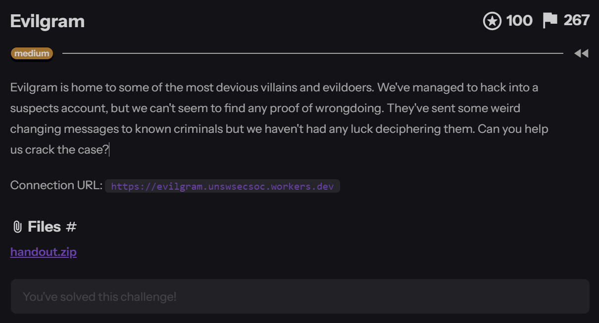
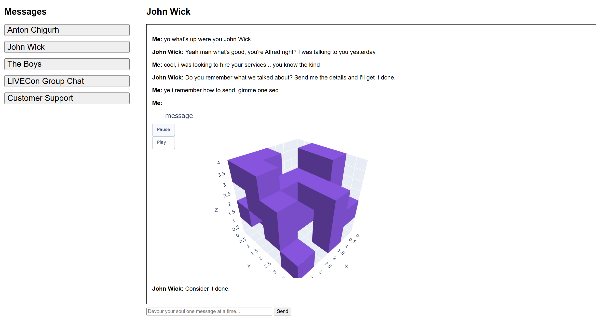
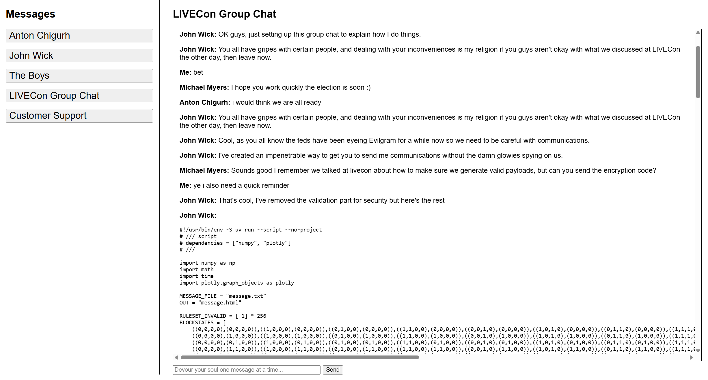
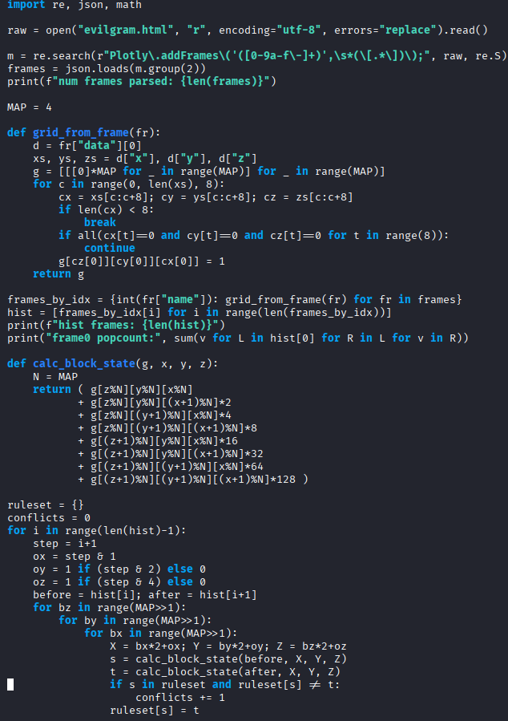
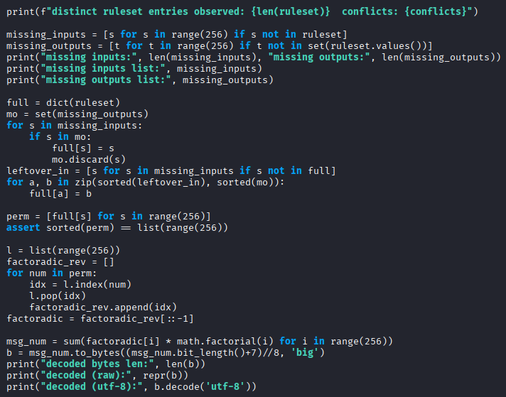
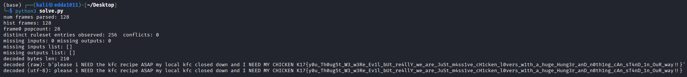

# Evilgram

**`K17{y0u_Th0ug5t_W3_w3Re_Ev1l_bUt_re4llY_we_are_JuSt_m4ss1ve_cH1cken_l0vers_w1th_a_huge_Hung3r_anD_n0th1ng_cAn_sT4nD_1n_OuR_way!!}`**

&nbsp;

**Category**: Reverse Engineer



**Resource Provided**
- **URL**: `https://evilgram.unswsecsoc.workers.dev` — We get a `handout.zip`. The website is just the same page, so the handout is all you need.

Previously: We've broken into a villain's Evilgram account. They've been sending weird changing messages to other criminals and nobody can read them.

---

&nbsp;

## Looking at the file

The zip has one file, `evilgram.html` — a fake chat app. Most chats are filler. Two matter:
- **John Wick chat**: "Me" sends a message that isn't text, it's a `3D animation of little cubes` (a 4x4x4 grid, 128 frames, cubes shifting around). That's the "changing message". That's our ciphertext.



- **LIVECon group chat**: John Wick just... pastes the `whole encryption script.`



Having the source makes life easy. Let's see what it does.

&nbsp;

## How the encryption works?

Plain-English version, three steps:

1. **Turn the flag into a "rule table"**

The flag becomes a big number, and that number gets turned into a shuffled list of 0-255 (using factoradic + Lehmer code — you don't need to understand the maths hahaha since it was too complicated or you can ask AI what is Lehmer. Learning knows no bounds!).

Think of it as a table: "state 5 becomes 173, state 6 becomes 42, …", 256 rules total. The key point: `this table maps one-to-one to the flag. Get the table, get the flag.`

2. **Use the table to move the cubes**

Start with a random 4x4x4 grid. Each step, chop it into eight 2x2x2 blocks. Each block has 8 cells, cube-or-no-cube, which is just a number from 0 to 255. Look it up in the table and swap in the new pattern.

Kind of like a Rubik's cube where every twist follows that secret table.

3. **Draw every step**

Run 128 steps, `save what the grid looks like at every step`, and send it as an animation.

&nbsp;

## The bug

The setter's idea: you can watch the cubes move, but without the table you can't decode anything.

Problem is, `he showed you every step.`

The rule table is literally "this block looked like X, next step it looks like Y". So compare two frames next to each other, check each block before and after, and you've just copied down a rule.

127 changes x 8 blocks = 1016 rules copied, for a table of only 256. In practice `all 256 showed up with zero contradictions.`

Analogy: you won't give me your codebook, but you show me every message alongside its encrypted version. I'll just write the codebook myself.

&nbsp;

## The solve script




`solve.py` does four things:

1. Pull the 128 frames of cube data out of the html
2. Rebuild each frame as a 4x4x4 grid
3. Compare neighbouring frames and copy out the full rule table
4. Run the encryption steps backwards on the table → flag

Two small traps:

- Frames are padded with fake `(0,0,0)` points so they're all the same length — skip those
- Going from frame `i` to frame `i+1` uses the block split for `step i+1`. Get this off by one and the rules you copy will contradict each other (the script counts `conflicts` — 0 means you're good)

```
import re, json, math

raw = open("evilgram.html", "r", encoding="utf-8", errors="replace").read()

m = re.search(r"Plotly\.addFrames\('([0-9a-f\-]+)',\s*(\[.*\])\);", raw, re.S)
frames = json.loads(m.group(2))
print(f"num frames parsed: {len(frames)}")

MAP = 4

def grid_from_frame(fr):
    d = fr["data"][0]
    xs, ys, zs = d["x"], d["y"], d["z"]
    g = [[[0]*MAP for _ in range(MAP)] for _ in range(MAP)]
    for c in range(0, len(xs), 8):
        cx = xs[c:c+8]; cy = ys[c:c+8]; cz = zs[c:c+8]
        if len(cx) < 8:
            break
        if all(cx[t]==0 and cy[t]==0 and cz[t]==0 for t in range(8)):
            continue
        g[cz[0]][cy[0]][cx[0]] = 1
    return g

frames_by_idx = {int(fr["name"]): grid_from_frame(fr) for fr in frames}
hist = [frames_by_idx[i] for i in range(len(frames_by_idx))]
print(f"hist frames: {len(hist)}")
print("frame0 popcount:", sum(v for L in hist[0] for R in L for v in R))

def calc_block_state(g, x, y, z):
    N = MAP
    return ( g[z%N][y%N][x%N]
           + g[z%N][y%N][(x+1)%N]*2
           + g[z%N][(y+1)%N][x%N]*4
           + g[z%N][(y+1)%N][(x+1)%N]*8
           + g[(z+1)%N][y%N][x%N]*16
           + g[(z+1)%N][y%N][(x+1)%N]*32
           + g[(z+1)%N][(y+1)%N][x%N]*64
           + g[(z+1)%N][(y+1)%N][(x+1)%N]*128 )

ruleset = {}
conflicts = 0
for i in range(len(hist)-1):
    step = i+1
    ox = step & 1
    oy = 1 if (step & 2) else 0
    oz = 1 if (step & 4) else 0
    before = hist[i]; after = hist[i+1]
    for bz in range(MAP>>1):
        for by in range(MAP>>1):
            for bx in range(MAP>>1):
                X = bx*2+ox; Y = by*2+oy; Z = bz*2+oz
                s = calc_block_state(before, X, Y, Z)
                t = calc_block_state(after, X, Y, Z)
                if s in ruleset and ruleset[s] != t:
                    conflicts += 1
                ruleset[s] = t

print(f"distinct ruleset entries observed: {len(ruleset)}  conflicts: {conflicts}")

missing_inputs = [s for s in range(256) if s not in ruleset]
missing_outputs = [t for t in range(256) if t not in set(ruleset.values())]
print("missing inputs:", len(missing_inputs), "missing outputs:", len(missing_outputs))
print("missing inputs list:", missing_inputs)
print("missing outputs list:", missing_outputs)

full = dict(ruleset)
mo = set(missing_outputs)
for s in missing_inputs:
    if s in mo:
        full[s] = s
        mo.discard(s)
leftover_in = [s for s in missing_inputs if s not in full]
for a, b in zip(sorted(leftover_in), sorted(mo)):
    full[a] = b

perm = [full[s] for s in range(256)]
assert sorted(perm) == list(range(256))

l = list(range(256))
factoradic_rev = []
for num in perm:
    idx = l.index(num)
    l.pop(idx)
    factoradic_rev.append(idx)
factoradic = factoradic_rev[::-1]

msg_num = sum(factoradic[i] * math.factorial(i) for i in range(256))
b = msg_num.to_bytes((msg_num.bit_length()+7)//8, 'big')
print("decoded bytes len:", len(b))
print("decoded (raw):", repr(b))
print("decoded (utf-8):", b.decode('utf-8'))
```

&nbsp;

## Run it

```
python3 solve.py
```



256 rules, 0 conflicts, and out comes 210 bytes:
`please i NEED the kfc recipe ASAP my local kfc closed down and I NEED MY CHICKEN K17{...}`

The KFC rant is just padding (and a joke).

&nbsp;

## Reflection

When I first opened this challenge I was honestly a bit lost. The html was 300KB, there was a 3D cube animation that kept changing, and a long script with factorials and cellular automata. My first thought was that this was going to be really hard and I probably couldn't solve it.

So I just went through the whole file slowly. Most of the chats turned out to be filler, and the only useful parts were the animation in the John Wick chat and the encryption code in the group chat. Then I went back to the prompt, saw "changing messages", and realised the animation was the ciphertext.

I didn't fully understand the factoradic and Lehmer code part of the code, but it turned out I didn't need to. I just needed to know the flag becomes a rule table, the cubes change according to that table every step, and the animation saves every step. So I could compare two frames next to each other to copy out the table, then work backwards to get the flag.

I did get stuck on a few things. At first I didn't notice the fake padding zeros at the end, and being off by one on the step number made the rules not match. I added a conflicts check, and once it showed 0 I knew it was right.

After finishing, it felt a lot less hard than I expected. The main thing was figuring out what it was actually doing and not getting scared by the maths. Sometimes you don't need to break the encryption itself, you just need to find where it leaks something.