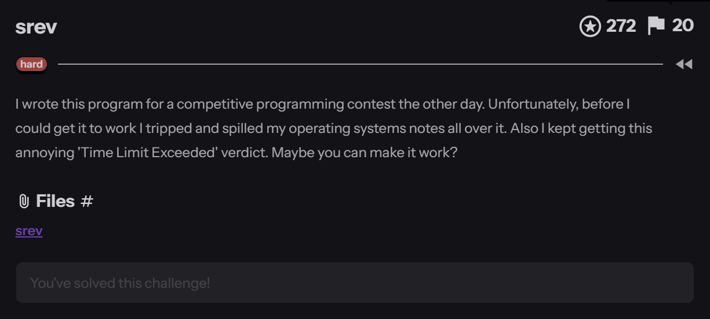
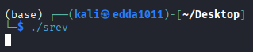
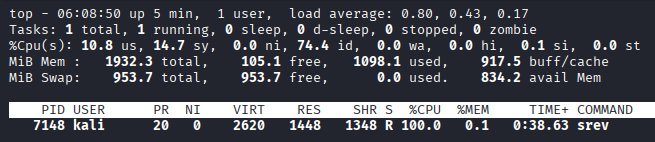
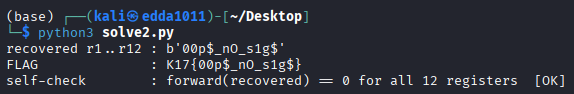

# Srev

**`K17{00p$_nO_s1g$}`**

&nbsp;

**Category**: Reverse Engineer



**Resource Provided**
- Binary: `srev` — a stripped 64-bit ELF, no source

Previously: The name is the whole joke: `sigrev`. This binary is a little virtual machine, but it refuses to run bytecode the way anything sane would. Instead of a fetch-decode-execute loop, every "instruction" is a frozen snapshot of the CPU, and the VM advances by asking the kernel `to return from a signal it never received`. It's cursed. It's also completely reversible once you stop being impressed by it — which is the point of the whole challenge.

---

&nbsp;

## First contact

`file` says stripped, no-PIE, NX. You run it, full of hope, and… nothing. It just sits there, fans spinning, forever. No prompt, no output, no flag. On the CTF platform this showed up as `Time Limit Exceeded` — the judge gave up waiting. (Worth being precise here for your own sanity: that message comes from the `platform's timeout`, not from `srev` itself. Run it locally and it will happily spin until the heat death of the universe or you press `Ctrl+C`, whichever comes first.)




A program that answers "run me" with a shrug and infinite CPU is telling you something: don't run it forward.

strings is more talkative:

```
signal setup
halt: empty stack
halt: depth=%zu
 r%u=%#lx
K17{
```

A "stack", a "depth", a register-printer (`r%u=%#lx`), and the word `signal` everywhere. That's a VM — and a VM that thinks in signals. `objdump` seals it: in the entire binary there is exactly one syscall instruction. One. A whole program funnelling every bit of work through a single `syscall` is not normal, and that syscall turns out to be the trick.

&nbsp;

## The cursed engine: SROP as a VM

Here's the mechanism, verifiable statically — no need to run a thing:

- `main` (`0x401150`) registers a handler for `SIGUSR1` (`sigaction(10, 0x401480)`), then `raise(10)` to kick things off. The init constants are sitting right there in the open: `0x123 = 291` instructions, `0x19 = 25` reusable "function frames".
- The instruction array lives at `0x403994`, `0xf8 = 248 bytes each`, 291 of them — filling `.rodata` to the last byte, which is a nice sign you've found the real thing and not a decoy.
- Each instruction is a fake `rt_sigframe` (a saved-CPU-state blob). To "execute" one, the handler copies a template to `0x42e900`, overlays the instruction's bytes on top, sets `rsp` to it, and fires `rt_sigreturn (mov $0xf,%rax; syscall` — yep, the syscall). The kernel dutifully reloads every register from that blob and jumps wherever the blob's saved RIP points.

That is `SROP` — sigreturn-oriented programming, normally an exploitation technique — repurposed as the VM's single-step primitive. Each instruction is literally a signal frame, and `rt_sigreturn` is the "goto next instruction" button. The "operating-systems notes" smeared across the binary aren't notes; they're these frames.

&nbsp;

## Peeking at the opcodes

Dispatch is a plain `cmp $0x9,%ebp` + jump table at `0x402038`. Dump all 291 instructions and the personality of the program jumps out immediately. The opcode census:

| opcode | meaning | count |
|---|---|---|
| 5 | `add` | 129 |
| 7 | `xor` | 108 |
| 6 | `sub` | 24 |
| 2 | `call` (frame) | 25 |
| 3 / 4 | `pick` / `drop` | 1 / 2 |
| 9 | `halt` + print | 2 |

No `ret`. No rotate. Overwhelmingly just `add, xor, sub` on a handful of registers. This is not a scary VM. This is a pocket calculator wearing a Halloween costume.

&nbsp;

## What the program actually does

1. Instruction 0 pushes a frame that holds twelve `0x20 bytes` — twelve spaces — into registers `r1–r12`. That's the candidate flag. Instruction 1 `picks` a working copy.
2. **Instructions 2–237 are one long, fixed, invertible transform** on those 12 registers. Three flavours only:
- `xor r,#k and add r,#k / sub r,#k` — constant mixing (the first dozen literally read `r1 ^= 0xa7`, `r2 ^= 0x3c`, …),
- `add rj,ri` — register-into-register diffusion (so bytes bleed into each other),
- xor-swaps — the classic `xor a,b; xor b,a; xor a,b` triple that swaps two registers with no temp.
3. **Instructions 238–290 are the trap.** It checks whether the transformed registers hit the win state; if not, it bumps the candidate one printable character at a time — the tidy ``add r,#1`` / ``call ffN if r >= 0x7f`` / ``sub r,#0x5f`` wrap-around blocks are a base-95 odometer — and loops back to transform again.

So the "intended" runtime behaviour is: try spaces, transform, check, increment, repeat… across ``95¹²`` candidates. That's the infinite spin you saw. The setter built a brute-forcer and shipped it knowing it can never finish — a small act of trolling that doubles as the hint.

&nbsp;

## The one idea that kills it

The win condition is dead simple: after the transform, all 12 registers equal 0. And look at what the transform is built from:

- `xor k` is its own inverse (xor `k` again),
- `add k` undoes with `sub k` (and vice versa),
- `add rj,ri` undoes with `rj -= ri`,
- an xor-swap undoes with the same xor-swap.

Every single step is reversible. So you never search. You take the win state — twelve zeros — and run the transform backwards. Whatever twelve values you get out are precisely the input that would forward-transform to zero. That input is the flag. The 95¹² odometer becomes 236 subtractions.

&nbsp;

## The solver

It reads the 291 instructions out of `.rodata`, keeps the transform slice (2–237), and walks it in reverse from all-zeros, undoing each step. Register-source adds are undone in reverse order, so each source register still holds its forward-time value when it's used — the inversion is exact. Then it `self-checks`: push the recovered bytes forward through the transform and confirm all 12 registers land on zero. If that passes, it isn't a guess.

```
import struct, sys

PATH = sys.argv[1] if len(sys.argv) > 1 else "srev"
data = open(PATH, "rb").read()

MASK = (1 << 64) - 1
V2F  = 0x400000
def rd(vaddr, n): return data[vaddr - V2F: vaddr - V2F + n]
def u64(b, o):    return struct.unpack_from("<Q", b, o)[0]

IN_BASE, IN_STRIDE, IN_COUNT = 0x403994, 0xf8, 291
prog = []
for i in range(IN_COUNT):
    raw = rd(IN_BASE + i * IN_STRIDE, 0xf8)
    prog.append((u64(raw, 0xa8) & 0xffffffff, u64(raw, 0x90)))

def parse(opd):
    d = opd & 0xf
    if (opd >> 4) & 1: return d, ("imm", opd >> 8)
    return d, ("reg", (opd >> 8) & 0xf)

TRANSFORM = prog[2:238]

def step(r, op, opd, inverse):
    d, (kind, v) = parse(opd)
    val = v if kind == "imm" else r[v]
    if   op == 5: r[d] = (r[d] - val) & MASK if inverse else (r[d] + val) & MASK
    elif op == 6: r[d] = (r[d] + val) & MASK if inverse else (r[d] - val) & MASK
    elif op == 7: r[d] = (r[d] ^ val) & MASK      # xor is its own inverse
    else: raise SystemExit("unexpected opcode %d in transform" % op)

def forward(regs):
    r = dict(regs)
    for op, opd in TRANSFORM:          step(r, op, opd, inverse=False)
    return r

def invert(regs):
    r = dict(regs)
    for op, opd in reversed(TRANSFORM): step(r, op, opd, inverse=True)
    return r

solution   = invert({i: 0 for i in range(1, 13)})
flag_bytes = bytes(solution[i] & 0xff for i in range(1, 13))

res = forward({i: solution[i] for i in range(1, 13)})
assert all(res[i] == 0 for i in range(1, 13)), "self-check failed"

print("recovered r1..r12 :", flag_bytes)
print("FLAG              : K17{%s}" % flag_bytes.decode())
print("self-check        : forward(recovered) == 0 for all 12 registers  [OK]")
```

Run it against the binary:



Twelve printable bytes on the first try, and the self-check passes. That's the real proof — not "it looks like a flag", but "the machine's own win condition is satisfied".

Say it out loud: `"oops, no sigs"` — a wink at the gimmick, because for all its signal theatrics the VM never handles a single real signal. It just abuses `sigreturn` as a jump and dares you to be intimidated.

&nbsp;

## Reflection

The math here is nothing — add, sub, xor, undo. The whole challenge is a test of nerve: can you look at a program that runs forever, built on an exploitation primitive, stripped and menacing, and calmly go "this is a reversible function and I'm going to run it backwards"? Recognising the SROP-VM is the wall; everything after it is a downhill roll. The infinite loop isn't an obstacle, it's the setter tapping the sign that reads don't play my game, break it.