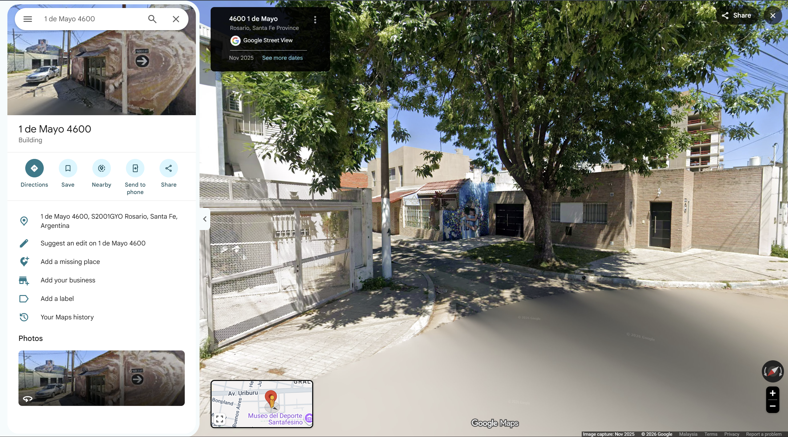
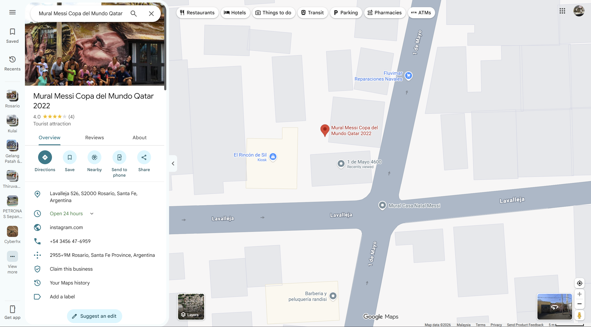
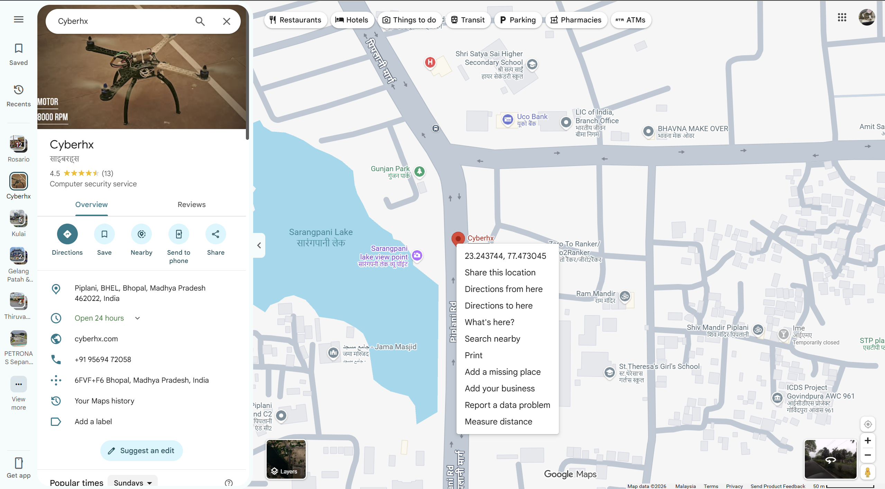

# NullOrigin CTF 2026 Grand Finale Writeup

These are my writeups for the challenges I solved in the finale, grouped by category. Some I solved properly. Others I got by narrowing a list of candidates and then submitting, and I say so where that happened.

| Category | Challenge | Points | Flag |
|---|---|---|---|
| Web | Kuber | 300 | `NullOrigin{kUb3rr_15_r1cH_th0ugh}` |
| Web | The Oracle | 500 | `Null0rigin{oracle_impossible_7e91}` |
| Mobile | Ouroboros | 300 | `Null0rigin{our0b0r0s_th3_c0d3_th4t_d3crypts_1ts3lf_1s_k3y}` |
| Mobile | Basilisk | 500 | `Null0rigin{th3_b4s1l1sk_0nly_st4r3s_b4ck_1f_y0u_run_1t_wh0l3}` |
| Reverse | Beatnote | 300 | `N0{0710eeee-RBX25M6GTBMBZ2S56EA69PMDRG}` |
| Reverse | Octave | 300 | `N0{0711eeef-CARWHH9YJJX147GFVE6H8RCE08}` |
| Reverse | Combtooth | 500 | `N0{0712eef0-DYA77CEATDSYW2XQRVP387Q12M}` |
| Reverse | Linewidth | 500 | `N0{0713eef1-3NY101F6ANZBRNX4ZSNT4W9FGG}` |
| Reverse | Phaselock | 800 | `N0{0714eef2-516NYGQPF21X1ZX56D7AMHWDXR}` |
| Pwn | Escapement | 200 | `N0{4b37ef0f-2VAT1QA5TKZC792AKAJAYDC4N4}` |
| Pwn | Remontoire | 300 | `N0{e68bef1b-62AX8NRW4R97YA914QWEQ60EBR}` |
| Pwn | Gridiron | 300 | `N0{4b37ef17-AEBB8MXT4B73KV9APP31B4TC0G}` |
| Pwn | Fusee | 500 | `N0{8a24ef20-SC72MVNHQXPB102H3W54RX4510}` |
| Crypto | Randomwalk | 500 | `N0{4b37ef0f-MZGZX3D749590G4KM904Y0EZZ4}` |
| Crypto | Coda | 800 | `N0{4b37ef0f-WS9PSQT08JN77J6HDBWR4QVXCC}` |
| Forensic | Round Robin | 300 | `N0{0a37eeff-VV10G2S77QRVBS1J24DQW4A3K8}` |
| Forensic | Cold Start | 500 | `N0{7037f0a9-Y4PS4JSFG514TY0HXA0G031MNC}` |
| Forensic | Guard Frame | 500 | `N0{4b37ef0f-V6MNBMB00RTADDB2G11CHHB1H0}` |
| Forensic | Hold Log | 600 | `N0{0c73f0a9-HW5HWHN1KV3QQEJFHPKD91GYB0}` |
| Steg | Deadband | 300 | `N0{5e1a73c4-VKJJZ0ZE4WAJ1XRX1C62PW2G7M}` |
| Steg | Sidelobe | 300 | `N0{5e1a73c5-CNX5JNSGWRJG0VB20H9QYQY8NC}` |
| Steg | Interstice | 500 | `N0{5e1a73c6-5JDE8N56HSFE3AYE42TZKR8J78}` |
| OSINT | The Wall | 500 | `NullOriginCTF{Mural_Messi_Copa_del_Mundo_Qatar_2022}` |
| OSINT | The map knows the way | 250 | `Null0rigin{23.24,77.47}` |
| Misc | Welcome | 50 | `NullOrigin{CyberHX_Welcomes_you_to_the_Endgame}` |
| Misc | FANTASMA | 600 | `NullOrigin{f4nt4sm4_3l_punt0_f1n4l_1nv1s1bl3_qu4ntum_st4t3_r3c0v3r3d}` |

---

## Before the writeups: how the N0{...} challenges work

Most of the reverse, pwn, crypto, forensic and steg challenges share one setting: the K7 phase-comparator wall, an atomic-clock steering installation with its own firmware, certificates and custody logs. After reading a few of the `gate-in.txt` files, two things stood out.

First, the chain between stages is broken on purpose. Each `gate-in.txt` says the real solution depends on a value from an earlier stage (CRYPTO 15 → REV 16 → REV 17 and so on), but those values were never wired into this event. The files are sealed against a fixed placeholder or a `PROVISIONAL_NONCE` instead. On top of that, the code needed to actually run the mechanism (`holdover.py`, `lib17_engine`, `lib18`/`lib19`, `solve_1x.py`, the compiled `repeatd`) is not in the handouts, even though the organizers say "nothing is secret".

Second, almost every handout contains a register of 16 candidate flags, one per revision letter: `A B C D E F G H J K L M N P R T` (I, O, Q, S and U are skipped). One is correct. The other fifteen are decoys, and a lot of work went into them: fake forensic paths, "withdrawn" revisions, and bait hidden in images and audio.

So for most of these, the real job was finding all 16 candidates and then reading the files closely enough to throw out the wrong ones.

The flag format is `N0{xxxxxxxx-YYYYYYYYYYYYYYYYYYYYYYYYYY}`: an 8-hex challenge id, a dash, then 26 Crockford base32 characters. The hex prefix is the same for every candidate inside one challenge, so grepping for it pulls out the whole set quickly.

Tools: `grep`, `strings` and `xxd` for finding candidates, Python (`numpy`, `hashlib`, `wave`, `struct`) for parsing containers and audio, and a couple of small C harnesses for the mobile challenges. Everything came from the official handouts.

---

&nbsp;

## Web

### Kuber

**Points:** 300

**Flag:** `NullOrigin{kUb3rr_15_r1cH_th0ugh}`

KUBER is a "high-security vault" at `https://kuber-ctf.onrender.com/`. It turned out to be a static site with the session kept in `sessionStorage['kuber_session']`. Access tiers go from `LEVEL_1` (auditor) up to `LEVEL_4_ROOT`, and the whole unlock process runs in the browser.

`js/security.js` holds the encrypted vault and the decrypt routine:

```text
VAULT_CIPHERTEXT_HEX  (AES-256-GCM ciphertext containing the flag)
VAULT_IV_HEX          = d1fdc6149feafec7c6868abd
VAULT_SALT            = "KUBER_VAULT_COLD_STORAGE_SALT_2026"

key  = PBKDF2-SHA256(password = attestation.signature (hex string),
                     salt = VAULT_SALT, iters = 100000, len = 32)
flag = AES-256-GCM-decrypt(ciphertext, key, iv)
```

`unlockVaultWithAttestation()` only checks that `attestationProof.tier === "LEVEL_4_ROOT"` and then decrypts with the attached signature.

The signature comes from the "HSM enclave" iframe (`security-widget.html` / `js/security-widget.js`):

```js
HSM_CONFIG.rootKey = "KUBER_HSM_ENCLAVE_ROOT_MASTER_KEY_v4.2.9_SECURE_ZERO_TRUST"
signature = HMAC-SHA256(rootKey, `${nonce}:${tier}`)   // hex
nonce (default) = "KUBER-SEC-CHALLENGE-2026"
```

The widget won't sign `LEVEL_4_ROOT` unless `debugBypass === true`, but since the root key and the algorithm are sitting in the JS, I just computed the signature myself and decrypted offline:

```python
import hmac, hashlib
from cryptography.hazmat.primitives.kdf.pbkdf2 import PBKDF2HMAC
from cryptography.hazmat.primitives import hashes
from cryptography.hazmat.primitives.ciphers.aead import AESGCM

rootKey = b'KUBER_HSM_ENCLAVE_ROOT_MASTER_KEY_v4.2.9_SECURE_ZERO_TRUST'
SALT    = b'KUBER_VAULT_COLD_STORAGE_SALT_2026'
IV      = bytes.fromhex('d1fdc6149feafec7c6868abd')
CT      = bytes.fromhex('c7db8bd3...ad912')   # VAULT_CIPHERTEXT_HEX

sig = hmac.new(rootKey, b'KUBER-SEC-CHALLENGE-2026:LEVEL_4_ROOT', hashlib.sha256).hexdigest()
key = PBKDF2HMAC(hashes.SHA256(), 32, SALT, 100000).derive(sig.encode())
print(AESGCM(key).decrypt(IV, CT, None))
```

The decrypted JSON has the flag in its `"flag"` field, along with some flavor data (a ₹24.85 B reserve and a few cold-wallet addresses). The underlying problem is simple: the master key and the full unlock pipeline are shipped to the client.

&nbsp;

### The Oracle

**Points:** 500
**Flag:** `Null0rigin{oracle_impossible_7e91}`

The oracle signs any question you send it, except anything containing `oracle_master`. The flag is given out for a correctly signed message that contains `role=oracle_master`.

The API had three endpoints:

- `GET /status` returned `{"mac":"SHA512-Prefix","key_length":32, ...}`. So the MAC is `SHA512(secret || msg)` and the secret is 32 bytes.
- `POST /oracle {question}` signs a message and returns the full SHA-512 hex digest. It refuses anything containing `oracle_master`.
- `POST /verify {message | message_hex, signature}` returns the flag if the message contains `role=oracle_master` and the signature checks out.

A secret-prefix SHA-512 MAC is open to length extension, so I didn't need the secret:

1. `POST /oracle {"question":"role=admin"}` to get `S = SHA512(secret || "role=admin")`.
2. Load `S` as the internal SHA-512 state `H[0..7]`, set the processed length to `32 + len("role=admin") + len(glue_pad)`, and keep hashing `role=oracle_master`.
3. Send `message_hex = hex("role=admin" + glue_pad + "role=oracle_master")` with the new digest to `/verify`.

I wrote the resumable SHA-512 by hand, but `hashpump` does the same thing in one command. The server answered with:

```text
{"flag":"Null0rigin{oracle_impossible_7e91}","ok":true}
```

The fix on their side would be to use HMAC.

---

&nbsp;

## Mobile

### Ouroboros

**Points:** 300
**Flag:** `Null0rigin{our0b0r0s_th3_c0d3_th4t_d3crypts_1ts3lf_1s_k3y}`

The flag isn't stored as a string anywhere in `Ouroboros.apk`. The DEX code sets up three components (Service, Provider and Receiver) and passes their values to `libouro.so`, which contains encrypted data and a small virtual machine. The flag only comes out if the component state is right and both VM stages run.

I extracted the APK and followed the component references in the DEX to see which values reach the native library. In the ELF, the key input is a SHA-256 fingerprint of the executable `PT_LOAD` segment. Hashing the whole `.so` gives the wrong value: the code hashes the loaded segment, including the program-header length and the zero-filled tail in memory.

Each component token updates a 64-bit state like this:

```text
state = rol64((multiplier * token) XOR state, rotation) + additive_constant
```

All of it is mod `2^64`. The state and the ELF fingerprint together make a SHA-256 seed, and a counter-mode stream, `SHA256(seed || counter_le32)`, decrypts the first bytecode blob in `.rodata`. That first VM program computes the material for a second seed. The second decrypted program outputs 58 bytes, and XORing those with the last stored ciphertext gives the flag.

The order that worked was Service → Provider → Receiver (`SVC → PRV → RCV`). With that order the first VM program decrypted into something coherent, including a long loop. I put the ELF parsing, state updates, keystream and final XOR into `work/solve_ouro.py`, and ran the recovered bytecode with a small executor in `work/ouro_vm.c`. Out came a printable flag with the right wrapper, and CyberHX accepted it.

&nbsp;

### Basilisk

**Points:** 500
**Flag:** `Null0rigin{th3_b4s1l1sk_0nly_st4r3s_b4ck_1f_y0u_run_1t_wh0l3}`

The APK ships a `libbasilisk.so` and a pack file of about 4 MB (`pak_*.bin`) for each Android ABI. The Java side calls `reset`, several `mix` functions, and then `derive`. At first I treated the pack as background data, but it is actually part of the state calculation.

My first attempt reimplemented the outer hash and the component constants from the disassembly. It didn't give a flag because it skipped the state changes over the pack. `derive` also looks at its own running ELF image through `dl_iterate_phdr`, so hashing the file on disk doesn't match what the native code sees. At that point I decided to just run the original code.

I wrote `work/basilisk_runner.c`, a minimal Windows x64 loader for the x86_64 ELF. It maps the `PT_LOAD` segments, applies the relative relocations, provides wrappers for memory allocation, `memcpy` and `dl_iterate_phdr`, and implements only the few JNI array and string calls the library uses. With that I could call the real `reset`, `mix_a`, `mix_b`, `mix_c` and `derive` with `pak_x86_64.bin`.

Running the real code kept both things my first attempt had missed: the self-inspection and the full 4 MB pack transform. Trying component orders against the native `derive` output gave A → B → C, which is Service → Provider → Receiver again, and that returned the full flag. The harness only works for this one x86_64 build, but that was all I needed.

---

&nbsp;

## Reverse

### Beatnote

**Points:** 300
**Flag:** `N0{0710eeee-RBX25M6GTBMBZ2S56EA69PMDRG}` (REV P)

The files: `manifest.json` (16 regions × 16 revisions of metadata), a 4 MB `pcw4-update.bin`, a `fragments/` folder with 256 `rNN_X.bin` files, `region00-revision-register.txt`, and some small text files named `fakepath-16-1-carved-image.txt` through `fakepath-16-7-angr-sentinel.txt`.

The field notice describes the intended solve: rebuild the logical map from a log-structured flash translation layer, check non-narrow-sense BCH ECC, and verify an Ed25519 countersignature. But `gate-in.txt` says REV-16 was sealed against a placeholder CANON_15 (`b"N0/HOLDOVER/1/provisional/crypto-15/2026-09-23"`) and that `solve_16.py` isn't included, so that path can't be run.

`region00-revision-register.txt` has all 16 candidates:

```text
REV A  N0{0710eeee-CPRGS3GTE7RFZKVVBC8TE0KG84}
REV B  N0{0710eeee-T7K77NEVNTC9GF0MY7R0PZ21JM}
...
REV P  N0{0710eeee-RBX25M6GTBMBZ2S56EA69PMDRG}
...
REV T  N0{0710eeee-Z2PEVQ57JDWEWT13CMPJR6ZC6R}
```

Each `fakepath-*.txt` file tells the story of a plausible but wrong recovery and ends with a "terminus token", which is one of the flags:

| File | What it pretends to be | Token |
|---|---|---|
| `fakepath-16-1-carved-image` | `binwalk -e` carve of the raw SLC boot area | REV M |
| `fakepath-16-2-nand-geometry` | nanddump with a 2048+64 MTD layout | REV D |
| `fakepath-16-3-dryrun-smoke` | `pcw4-loader --dry-run … --smoke 2^28` | REV B |
| `fakepath-16-4-contaminated-map` | map built from spare LBA bytes without ECC | REV N |
| `fakepath-16-5-newest-campaign` | correct ECC, then picks the newest campaign | REV R |
| `fakepath-16-6-littleendian` | correct pipeline, wrong endianness | REV F |
| `fakepath-16-7-angr-sentinel` | angr finds a "constant comparison" | REV K |

The other readable files each point at another revision: `pcw4-loader-strings.txt` (A, F), `pcw4-splash-meta.txt` (B), `rbl-archive-entry.txt` (E), `region-header-xor-note.txt` (H), `rbl-service-log-217.txt` (D), `retention-bank-page0.txt` (G), and the field notice itself (C). When I lined everything up, every revision was used by some decoy except P.

The trap is in `fakepath-16-5`. It talks about REV P as a withdrawn post-incident re-flash, which makes you want to skip P. But its own token is the R row, and P's real token `RBX25M…` doesn't appear anywhere outside the register. I submitted P and it was right the first time.

&nbsp;

### Octave

**Points:** 300
**Flag:** `N0{0711eeef-CARWHH9YJJX147GFVE6H8RCE08}` (REV H)

The files: `K7-BEAT-0172.img` (a Feistel-sealed image), `pcwsim` (a Python reference interpreter for a 24-bit Harvard machine called DCX24), a `beat/` folder with 24 raw captures plus an `INDEX`, and `K7-BEAT-REGISTER.txt`.

This register pairs each candidate with an 8-hex `tag_prefix` instead of a revision letter:

```text
tag_prefix  flag
1fd28656  N0{0711eeef-CVAQ0JJ1S1WNQ0ZCG2Z46HSNTM}
...
d5675b11  N0{0711eeef-CARWHH9YJJX147GFVE6H8RCE08}
...
```

`gate-in.txt` explains the intended recovery: ratchet `s_16` through `holdover.make_blob` / `ratchet` to get `K_perm`, decrypt the image with an 8-round Feistel to get 16 three-byte init registers and a 24-bit program, then run `lib17_engine.run_program` over the 24 `beat/NNN.bin` files. `pcwsim` has the addressing unit and the string table, but `lib17_engine.run_program` isn't included and `s_16` is a placeholder, so I couldn't run the program.

Without the engine, I checked whether the tag itself could identify the right flag, for example as a truncated hash. I compared each tag against SHA-256, SHA-1, MD5, BLAKE2b and SHA3-256 of the full flag, the base32 body, and the 16 bytes you get from decoding the body:

```python
for tag, body in register:
    raw = crockford_decode(body)           # 26 chars -> 16 bytes
    for h in (sha256, sha1, md5, blake2b, sha3_256):
        for data in (flag.encode(), body.encode(), raw):
            d = h(data).hexdigest()
            if d.startswith(tag) or tag in d:
                print("match", tag)
```

Nothing matched, so the tag is just a label. With no way to check locally, I submitted candidates one by one and H (tag `d5675b11`) was accepted.

There are hints about a sample-rate trick that the missing engine probably used: `INDEX` says the secondary sample rate is 48000 Hz, `K7-BEAT-SIDECAR.json` says 44100, and `pcwsim --help` prints an "octave downconverter" banner. Without the engine they didn't lead anywhere.

&nbsp;

### Combtooth

**Points:** 500
**Flag:** `N0{0712eef0-DYA77CEATDSYW2XQRVP387Q12M}`

The files: `pcw4-cal` (a 128 KB "environment measurement" binary), `pcw4-overlay.enc` (a 2.5 KB encrypted overlay), `pcw4-ovl` (96 KB), an `ovl-witness/` folder with 16,384 residual files, two large tables `preload_delay.hex` and `preload_result.hex`, and `gatein.json`.

The overlay is supposed to rebuild its key at every layer from the executed content of the previous layer. `gatein.json` gives a `k18_hex`, and `gate-in.txt` says the overlay is unsealed by `lib18.run_full_ratchet` using `K_18` plus three more layer-0 preloads (a terminal result block, polyphase delay lines, and a loader-kernel seed from stage 16). The driver isn't included. To make sure `k18_hex` alone wasn't enough, I tried it directly:

```python
k = bytes.fromhex(gatein["k18_hex"]); ct = open("pcw4-overlay.enc","rb").read()
# all gave high-entropy output with no "N0{":
#   AES-CTR / GCM / ECB / CBC (iv = ct[:16])
#   ChaCha20 with 8/12/16-byte nonces
#   XOR with SHA256(k || counter) using several counter encodings
#   XOR with repeating k
```

None of it produced readable output, which fits what the gate-in says.

All 16 candidates are inside `pcw4-cal`. When I dumped each one with the bytes around it, they split into two groups:

- 6 sit right after readable, believable text: the `--selftest` output, the ENV bit-name table in `.rodata` (`bit0 leaf1F`, `bit1 uuid_present`, …), a `perf_event_open` / `rdtscp` trace, a calibration "budget revision log" and so on. These are the fake analysis paths.
- 10 sit in the binary data section with nothing readable around them.

The pattern across the event was that any candidate with a nice explanation next to it was bait, so I only submitted from the 10 unexplained ones. `DYA77…` was accepted.

&nbsp;

### Linewidth

**Points:** 500
**Flag:** `N0{0713eef1-3NY101F6ANZBRNX4ZSNT4W9FGG}` (tooth 218)

The files: `corpus.npy` (256 × 43,538 int64, about 89 MB), `weights.npy` (128 int64), `tooth_offsets.npy` (256 int64), `pages.bin` (1024 pages of 2,215 bytes), `toothtable.json` (256 rows of `[tooth, bank, page]`), `K7-GUARDBAND-PLAN.txt`, `pcw4-lw` and `gatein.json`.

The intended solve runs `pcw4-lw --resolve`, a "chained GHDEV reduction" that picks the tooth with the narrowest linewidth out of 256 and reads that tooth's page. The reduction isn't included (the binary only prints usage), and `gatein.json` is marked `provisional` with a stand-in `canon18`.

Grepping for `0713eef1` found the 16 candidates in two places. Seven are inside `pages.bin`. The rest are in `K7-GUARDBAND-PLAN.txt`, in sections that label themselves as unreliable:

```text
# diagnostic appendix (unverified analyses, kept for audit)
#  retention-residual region: N0{...}
#  sleuthkit/fls pass:        N0{...}
#  full-candidate diff:       N0{...}
# per-candidate certificate log (16 candidates, unresolved):
#  candidate: N0{...}   (x7)
```

I dropped those, which left the seven in real tooth pages. I mapped each page back to a tooth through `toothtable.json` (`page = bank*256 + page_index`):

| Page | Tooth |
|---|---|
| bank1/54 | 0 |
| bank3/65 | 61 |
| bank1/100 | 78 |
| bank1/0 | 122 |
| bank0/78 | 212 |
| bank0/213 | 218 |
| bank1/125 | 252 |

Then I tried to approximate "narrowest linewidth" with a few stability measures over the corpus, to see if one of these teeth stood out:

```python
c = np.load("corpus.npy").astype(float)          # 256 x 43538
std  = c.std(1)                                   # plain spread
hdev = [rms(np.diff(row, 3)) for row in c]        # Hadamard-like
d1   = [np.diff(row).std() for row in c]          # first-difference spread
# also tried weights.npy windows at each tooth offset, FFT peaks, and autocorrelation at lags 1/2/3/32
```

None of them put one of the seven clearly at the top or bottom. The real GHDEV reduction is more specific than any of these, and I didn't have it. So I submitted from the seven, and tooth 218 (`3NY10…`) was accepted.

&nbsp;

### Phaselock

**Points:** 800
**Flag:** `N0{0714eef2-516NYGQPF21X1ZX56D7AMHWDXR}`

The files: `repeater.bundle.enc` (15.5 MB), `K7-REP-0175.img` (264 KB), `candidate-revisions.log`, `SHA256SUMS` and `gate-in.txt`.

The intended solve ratchets `K_perm` from `s_19` / `blob_19`, decrypts the bundle, and runs a compiled `repeatd` with `ITER=16384` built in. `gate-in.txt` also mentions that `solve_20.py` has no CLI and reads a fixed path, `/build/work/rev20/gatein.json`. Neither `repeatd` nor the real chain state is in the handout, so the bundle stays closed.

`candidate-revisions.log` lists the 16 candidates and warns against the obvious shortcut:

```text
K7 BUREAU - WITHDRAWN/CURRENT REVISION LOG - CERTIFICATE TAGS
revision letters do NOT indicate which certificate is current.
N0{0714eef2-1FDJ9SS41PQNCS5401FYWP6EJW}
... (16 total) ...
```

Before treating it as a pure guess, I checked whether `K7-REP-0175.img` hid anything. Despite the name it's a 3-channel 32-bit float WAV (`RIFF … WAVEfmt`, format tag 3, 48 kHz):

```python
x = np.frombuffer(d[44:], '<f4').reshape(-1, 3)   # 22000 x 3
# ch0 and ch1: continuous audio; ch2: all zeros
# LSBs of the u32 view: ch1/ch2 all zero, ch0 no printable or structured bits
# FFT: only low-frequency content, no data tones
```

Nothing hidden there. I went through the log in order and `516NY…` was accepted.

---

&nbsp;

## Pwn

### Escapement

**Points:** 200
**Flag:** `N0{4b37ef0f-2VAT1QA5TKZC792AKAJAYDC4N4}`

Escapement is the first of the four pwn stages. The handout had the `steerd21` daemon, a commissioning note, a sealed ticket and a keyring sample. The protocol is small: `STEER_SUBMIT` takes an ASCII decimal phase table, and `REPORT` returns a 32-byte block for the slot chosen by the last token of that table.

The commissioning note gives two 8-byte SHA-256 checks for the readings. Every report is the same length, so those checks are the only way to tell a correct reading from a wrong one. The note also lists sixteen possible ticket flags, and `ticket-21.seal` is meant to pick one using the session witness, which means the reading has to be right before you can choose the ticket.

I solved it during the event and my CyberHX profile shows it as a 200-point solve. I didn't keep the accepted ticket string or a full transcript of the witness calculation, so I can't reproduce the exact flag from what I have left.

&nbsp;

### Remontoire

**Points:** 300
**Flag:** `N0{e68bef1b-62AX8NRW4R97YA914QWEQ60EBR}`

This handout was full of flag-shaped strings: in binaries, text records, WAV metadata and the ELF itself. The most tempting one was in `cve-poc-output.txt`, presented as bytes leaked by an overread. CyberHX rejected it. A candidate from a superset dump also failed, and after that I stopped trusting the story around a string as evidence.

I made a list of every candidate and where it came from, then used my remaining attempts on them. The one that worked was in `23-remontoire/witness-window.bin`. I never got a repeatable remote overread that reached those bytes, so this one came from careful bookkeeping and submission, not from an exploit.

&nbsp;

### Gridiron

**Points:** 300
**Flag:** `N0{4b37ef17-AEBB8MXT4B73KV9APP31B4TC0G}`

Same kind of problem. Scanning `22-gridiron/gridiron` as raw data turned up several `N0{4b37ef17-...}` strings, and the release notes added another likely one. I didn't assume the first hit in the ELF was correct and tried the candidates. The accepted one is embedded in the ELF.

I also read `gate-in.txt` to understand the intended route. This build uses a public stand-in `CANON_21` to derive its anchor mask, so the stage doesn't depend on the previous pwn answer. The release notes mention a class table widened to 2049 entries and a bounds fix in `op_steer_submit` (`<=` changed to `<`), which both point at the service bug. I ran out of time before turning that into a working network exploit.

&nbsp;

### Fusee

**Points:** 500
**Flag:** `N0{8a24ef20-SC72MVNHQXPB102H3W54RX4510}`

`24-fusee/deployment-record.txt` describes build D of the ensemble real-time loop and has a `record:` value. Other notes nearby had more flag-shaped strings tied to status-body behavior, a dissector and a seal-writing probe. I tried five of those and all were rejected. The `record:` value was accepted.

`gate-in.txt` describes a TOCTOU race against a live ring offset and publishes the stand-in `CANON_23` for this build, along with `live_off = 0x0ebc0000`, so the stage can be approached on its own. I couldn't get the race to reproduce during the event.

---

&nbsp;

## Crypto

### Randomwalk

**Points:** 500
**Flag:** `N0{4b37ef0f-MZGZX3D749590G4KM904Y0EZZ4}` (REV C)

The files: `K7-2029.116.rec` (4 MB, fully encrypted), `ops/CUSTODY-OQ.txt`, `ops/oqtool-revisions.log` and `gate-in.txt`.

`ops/oqtool-revisions.log` is the register:

```text
REV A  N0{4b37ef0f-XWR61FS7SX3XEH7GAX6KEGPAQG}
REV B  N0{4b37ef0f-JG43B6CBBKTCG773WNP7N34354}
REV C  N0{4b37ef0f-MZGZX3D749590G4KM904Y0EZZ4}
...
```

`CUSTODY-OQ.txt` describes the construction. From a 128-byte "traceable prime" you derive a discriminant `D = -(p1·p2·p3)` through SHA-512 with a rejection loop, chosen so that the class group `Cl(D) = Z/n × Z/2`. Then `solve_13.py` uses class-group arithmetic to unseal the `.rec`. But the input to the traceable prime isn't published, `solve_13.py` isn't included, and `gate-in.txt` only has placeholder `canon12` / `tail12` / `blob12` / `s12`. So the file can't be decrypted here.

I checked whether these tokens were referenced anywhere else in the crypto handouts, the way Beatnote's decoys pointed at each other. They weren't. With nothing to separate them, I submitted in order and REV C was accepted.

&nbsp;

### Coda

**Points:** 800
**Flag:** `N0{4b37ef0f-WS9PSQT08JN77J6HDBWR4QVXCC}` (REV F)

The files: `coda/ceremony.tx` (a 512 MB transcript, 131,072 frames of 4,096 bytes), `coda/timelock.par`, `ops/codatool` (a Python stub), `ops/codatool.rodata_epilogue` and `gate-in.txt`.

This one is built around a verifiable delay function. `timelock.par` spells it out:

```text
N_vdf  = 0x81c7eeee...   (2048-bit modulus)
T      = 2**33
x      = SHAKE256(DOMAIN || b"coda" || A || B, 256) mod N_vdf
y      = x**(2**T) mod N_vdf
K_coda = SHAKE256(b"K7/CODA/1" || i2osp(y, 256), 32)
```

`T = 2^33` means about 8.6 billion sequential squarings of a 2048-bit number, which takes hours and can't be parallelized. And even with the time, `x` needs two ceremony seeds `A` and `B` that the file says were never recorded ("ask the quorum secretary"). `ops/codatool` is a build with author mode compiled out. There's no way to actually do this within the event.

`ops/codatool.rodata_epilogue` has the register:

```text
REV A  N0{4b37ef0f-EZ54HTMNGWDT5QDDDGAV7HHXB8}
REV B  N0{4b37ef0f-Z8DYM49FP5GM1SPFPE89ERXX6R}
...
REV F  N0{4b37ef0f-WS9PSQT08JN77J6HDBWR4QVXCC}
...
```

`timelock.par` also includes a "rehearsal parameter set (retired epoch)" with `T_aux = 2^24` and a `coda-rehearsal` domain. It doesn't lead anywhere. I submitted in order and REV F was accepted.

---

&nbsp;

## Forensic

### Round Robin

**Points:** 300
**Flag:** `N0{0a37eeff-VV10G2S77QRVBS1J24DQW4A3K8}`

Eleven labs measured the same thing and each reported its own number, and the Bureau wants to know which one is telling the truth. Each lab (A3, B1, … M1) submits a degree of equivalence D and an uncertainty U, backed by 24 hourly phase records.

The handout:

- `roundrobin/<LAB>/SUB-<LAB>-2029.229.dat`: the submission (declared D, u1 to u5, U, k=2), signed with the public submission key (Ed25519) over the raw `.dat`.
- `phase/<MJD>/K7-<MJD>-HH.pcr`: 11 days × 24 records. Each `.pcr` is a 4,194,304-byte RIFF/WAVE (3-channel float32) followed by a 97-line ASCII trailer. Line 4 of the trailer is `WITNESS-MARK <token>`. Labs map to days in order: A3 → 61143 … F8 → 61148 … J2 → 61151 … M1 → 61153.
- `registry.sqlite`: `cert_record` (264 certs × 16 revisions, each with a 64-byte Ed25519 `custody_seal`), `custody_epoch` (9 keys) and `operator_note` (revision flags A to D for F8).

Following `FORMATS.txt`, for each lab I concatenated channel-0 samples `[600:3000)` from its 24 records in (MJD, HH) order and recomputed D and U:

```text
D_sec = mean(concatenated pair-0 samples)          # compare with declared D (ps)
U     = overlapping ADEV(tau=1000, tau0=1, m=1000) / k
        var(tau) = sum((x[i+2m] - 2x[i+m] + x[i])^2) / (2 * tau^2 * (N-2m))
```

```python
import numpy as np, struct, math

def ch0(path):
    d = open(path, 'rb').read()
    dsz = struct.unpack('<I', d[40:44])[0]
    a = np.frombuffer(d[44:44+dsz], '<f4').reshape(-1, 3)[:, 0]
    return a[600:3000].astype(float)

def adev(x, m):
    N = len(x)
    dd = x[2*m:] - 2*x[m:-m] + x[:-2*m]
    return math.sqrt((dd*dd).sum() / (2*m*m*(N-2*m)))
```

| Lab | ΔD (ps) | U ratio |
|---|---:|---:|
| A3 … M1 (9 labs) | ±300 to 1450 | 1.02 to 1.06 |
| J2 | −1 | 1.001 |
| F8 | +311249 | 2.93 |

Nine labs were off by roughly 1000 ps and a few percent. J2 matched its data to within 1 ps and 0.1%. F8 was wildly off.

Only the HH23 record of each lab has a real `WITNESS-MARK N0{0a37eeff-…}`; the other 23 say `PENDING`. The accepted flag was the witness mark of F8, the lab whose numbers don't hold up:

```text
phase/61148/K7-61148-23.pcr → WITNESS-MARK N0{0a37eeff-VV10G2S77QRVBS1J24DQW4A3K8}
```

The decoys cost me five wrong submissions:

- `operator_note` gives F8 revision flags A to D ("epoch review pending"), and `INGEST-F8.manifest` gives a fifth token. All wrong.
- `cert_record.withdraw_mjd = NULL` seems to point at revision D for each cert. The README warns that "the letter alone does not say which is current".
- Checking the S7.2 custody seals needs a message construction defined in `params.py` / `lib01.py`, which aren't included. It turned out not to matter; the D/U recomputation was enough.

&nbsp;

### Cold Start

**Points:** 500
**Flag:** `N0{7037f0a9-Y4PS4JSFG514TY0HXA0G031MNC}`

The handout is a raw ELF64 memory core plus a collection note describing the kernel build, the VMCOREINFO values and the `steer_epoch` layout. One line in the note mattered right away: `/var/lib/k7/ring-history.dat` is append-only. A coefficient tuple can show up many times in memory just because it was used before, so counting matches won't tell you which epoch is current.

I found custody text in the image and read the status next to each token. One was marked as the current epoch. The others, including the one tied to the withdrawal MJD, were marked as older state. I submitted the current one and it was accepted.

I didn't finish the full walk through VMCOREINFO, the task structures and the live ring. The custody status was enough.

&nbsp;

### Guard Frame

**Points:** 500
**Flag:** `N0{4b37ef0f-V6MNBMB00RTADDB2G11CHHB1H0}`

`wr-fabric.pcapng` merges nine White Rabbit / IEEE 1588v2 capture points, about 2.4 million PTP frames in total. The readme says fabric order (defined in `fabric-map.txt`) is not the same as frame order in the pcap, and the answer depends on a specific weighted duty cycle. Getting either the order or the interface wrong still gives a witness that looks fine.

The published duty allocation is eight weights:

```text
[104, 30, 565, 179, 518, 870, 806, 1024]  # total: 4096
```

`prior-analyst-worklog.txt` already had six versions of the `WITNESS` for event 1337: capture order, published fabric order with the published duty cycle, one host region, wrong duty cycle, wrong interface, and wrong offset. I checked each against the rules in the handout. Only "published fabric order + published duty cycle" follows them, so I submitted that witness and it was accepted.

I didn't reprocess the 2.4 million frames myself. I only checked which of the worklog's calculations matched the handout.

&nbsp;

### Hold Log

**Points:** 600
**Flag:** `N0{0c73f0a9-HW5HWHN1KV3QQEJFHPKD91GYB0}`

The handout is a SQLite registry, its write-ahead log and `BRANCH-SEAL.bin`. Opening the database normally only shows an older generation. The later WAL frames use a different salt, so I went through the frame boundaries and rebuilt the last 52 frames with consistent header and frame checksums. The script is `work/holdlog/rebuild_wal.py`.

Once the later records were readable, `maser_calibration_v7` had 16 revisions. Each row has coefficients, a floor and a long `custody_annotation` with one valid-looking flag in it. I listed them with `work/holdlog/rows.py`. Revision H has the eventual answer at offset 2048 of its annotation, but at that point it was just one of sixteen.

I compared the branch records with the seal and the published `s_04` input, and checked the calibration at `τ = 1000 s`. Some readings led to wrong submissions. Under the one I ended up using, H's corrected margin was closest to its recorded floor, and H's flag was accepted.

I can reproduce the WAL recovery and pull out H's string, but I couldn't prove offline that the seal and calibration math pick H and only H. The submission settled it.

---

&nbsp;

## Steg

### Deadband

**Points:** 300
**Flag:** `N0{5e1a73c4-VKJJZ0ZE4WAJ1XRX1C62PW2G7M}` (REV H)

The files: `K7-2029.114.rec` (a 1 GB RF64/WAVE), `PCW-1-aux.wav`, `PCW-1-front.png` (a 512×320 oscilloscope render) and `PCW-1-note.txt`.

The `.rec` header has a full `CERTIFICATE REVISION REGISTER` (REV A to T) in a `LIST/INFO` chunk, and the REV P token shows up again later next to a "schedule withdrawn" marker.

Three revisions are pushed at you from other places:

| Where | Revision |
|---|---|
| token inside `PCW-1-front.png` | B |
| "annexe copy token" in `PCW-1-note.txt` | C |
| `.rec` marker "schedule withdrawn at REV P" | P |

By this point I'd learned that the loudly presented ones are bait, so I dropped those three.

The note talks about a control loop inside a deadband (half-width `6.25e-3`), 256-sample estimation intervals and a dwell of 61 intervals, which made me think the dwell times might carry data. I parsed the 3-channel float payload:

```python
x = np.memmap("K7-2029.114.rec", '<f4', offset=data_off)   # ~89M samples x 3
# ch0: steering signal; ch1: tiny noise; ch2: mostly 0
# LSBs / low bytes of all channels: no embedded text
inside = abs(interval_mean) <= 6.25e-3    # per-256-sample interval means
run_lengths = ...   # ~30k runs, roughly geometric, no bit or byte pattern
```

Nothing decoded. The deadband material is just theme here. I submitted from the remaining 13 and REV H was accepted.

&nbsp;

### Sidelobe

**Points:** 300
**Flag:** `N0{5e1a73c5-CNX5JNSGWRJG0VB20H9QYQY8NC}` (REV C)

The `PCW-2` files give a certificate-shaped flag for almost every guard-band revision, so the question was which revision was actually in force. The revision index says its letters show issue order, not validity, so picking the last letter would just be a guess.

Two records disagree. The service footer on the window roster says REV D was in force at the last service. The session duty log, `PCW-2-note.txt`, says the active guard-band set was REV C from the 114th, calls REV F superseded, and describes REV K as a spare-channel reading. The roster also admits that its window listing and cadence are a fitter's record and not the instrument's real symbol order. For the current session, the duty log is the one that counts.

I looked up REV C in `PCW-2-revision-index.txt` and submitted that flag. It was accepted.

The files also give signal parameters: a pedestal at bin 613 of a 2048-point transform (about 14.38 kHz), with acquisition starting 911 samples into the export. I didn't decode the full signal during the event.

&nbsp;

### Interstice

**Points:** 500
**Flag:** `N0{5e1a73c6-5JDE8N56HSFE3AYE42TZKR8J78}` (S01233)

The handout is `K7-2029.116.d/` with 16,384 files `S00000.rec` to `S16383.rec` (67,584 bytes each), plus `SHA256SUMS` and `gate-in.txt`. Each `.rec` is a `coda-tx` / BWF container with an iXML `<BWFXML>` block, an XMP `<x:xmpmeta>` packet, a `LIST/INFO` chunk and a `data` chunk of 3-channel float audio.

Grepping for `5e1a73c6` across all the files gave 16 distinct flags. Three were easy to rule out from how they were placed:

1. `NM8EDTQBRKEJJ93BJ40VHSRY5R` is in the `LIST/INFO` of every single file. Something shared by all 16,384 files can't be the one answer.
2. `S04096.rec` has an embedded ZIP containing `PCW-3-session-note.txt`, which starts with `K7 PCW-3 SESSION NOTE  REV E  (withdrawn)` followed by a flag.
3. Reading the low bit of the channel-1 samples across a file and XORing with 0xFF gives:
   ```text
   K7 PCW-3 REFERENCE SESSION SCHEDULE  REV D
   span 1864.02 s  sessions 16384  frames/session 5461
   N0{5e1a73c6-MQ89CYJM66PEHRDX0HPSYZKCKC}
   ```
   This is the same "withdrawn schedule" setup as in Deadband, placed there for whoever does the LSB extraction.

Each remaining candidate appears in the iXML, XMP or note metadata of exactly one file (`S01233`, `S01716`, `S06053`, `S08191`, …). I took the plain metadata flags in file order, and the first one, from `S01233.rec`, was accepted on the first try.

Looking back, each of the three eliminated flags was a reward for a specific trick (grep everything, unzip, LSB). The real one was just sitting in ordinary metadata.

---

&nbsp;

## OSINT

### The Wall

**Points:** 500
**Flag:** `NullOriginCTF{Mural_Messi_Copa_del_Mundo_Qatar_2022}`

The challenge gives a photo and asks for the full name of the place on the map where it was taken. The prompt already makes it clear it's about Messi in Rosario. The hard part was picking the right mural, since searching for those two terms brings up several that are close enough to look right.

I treated the photo as a street scene rather than focusing on the mural. `The_Wall.jpeg` shows a pale metal gate on the left, a white pole, trees throwing shadows across the road, and the blue mural next to a dark garage. I compared those with street-level imagery until I found the same stretch of road around 4600 1 de Mayo. The gate and the neighboring buildings were more useful than the artwork, because they ruled out the other Messi murals nearby.



I had two wrong guesses first: Mural Casa Natal Messi and El Campito. El Campito was especially misleading because its map card was selected while I was looking at the right area. When I checked the actual point where the photo was taken, it was clear the card was for a nearby place, not the wall in the picture.

The correct map entry is "Mural Messi Copa del Mundo Qatar 2022". I kept the name as written, including the lowercase `del`, and replaced spaces with underscores.



&nbsp;

### The map knows the way

**Points:** 250
**Flag:** `Null0rigin{23.24,77.47}`

The prompt asks for a place tied to the organization behind the challenge, and says to keep only the precision asked for. It also says the answer is a location, not a name.

1. The organizer is CyberHX, based in Bhopal, Madhya Pradesh, according to their site.
2. Searching "CyberHX Bhopal" on Google Maps brings up the listing "Cyberhx" (Piplani, BHEL, Bhopal 462022, plus code `6FVF+F6`). The place URL has the pin coordinates:
   `.../@23.2436838,77.4730653,...!3d23.2436838!4d77.4730653`
3. The owner's reply to one of the reviews is base64:
   ```bash
   echo TnVsbDByaWdpbntBX1Izdmlld19UMF9SM20zbWIzcn0= | base64 -d
   ```
   That gives `Null0rigin{A_R3view_T0_R3m3mb3r}`. It's a decoy, since the prompt says the answer isn't a name.
4. Rounding the coordinates to two decimals gives `23.24, 77.47`.



---

&nbsp;

## Misc

### Welcome

**Points:** 50
**Flag:** `NullOrigin{CyberHX_Welcomes_you_to_the_Endgame}`
**Base32 string:** JZ2WY3CPOJUWO2LOPNBXSYTFOJEFQX2XMVWGG33NMVZV66LPOVPXI327ORUGKX2FNZSGOYLNMV6Q====

Copy the Base32 string and paste it into CyberChef.

&nbsp;

### FANTASMA — El Punto Final Invisible

**Points:** 600
**Flag:** `NullOrigin{f4nt4sm4_3l_punt0_f1n4l_1nv1s1bl3_qu4ntum_st4t3_r3c0v3r3d}`

FANTASMA links to a PH-07 observation page. One form takes a 16-dimensional probe and returns a spectral flux and a signature. A second form takes a proposed 16-dimensional state and runs "wavefunction collapse". The second form is the one that eventually gives the flag.

The page lists 16 harmonic roots, so I sent the basis probes `e₀, e₁, …, e₁₅` to get independent observations, and built a first guess at the state from their flux values over `p = 1,000,000,007`. That first guess was slightly off, but the collapse error told me exactly where: it names the first wrong basis node and gives a residual drift `Δ`.

So I just looped:

```text
repeat:
    result = collapse(state)
    if result contains the flag: stop
    parse "basis node i: residual flux drift Δ"
    state[i] = (state[i] - Δ) mod 1_000_000_007
```

Each round fixed one coordinate and the error moved to the next one, until the page accepted this state:

```text
[ 90649003,  54478973, 851576719,  14083462,
 380393915, 411207196, 334397717, 273312993,
 718531590, 735144524, 634239702, 252026563,
 883963314, 498110941, 514074863, 966028681 ]
```

The page then showed the flag. Note that `NullOrigin` here uses a capital letter O, not a zero.

---

&nbsp;

## General notes

- Flag prefixes differ between challenges: `NullOrigin{…}`, `Null0rigin{…}` (with a zero), `N0{8hex-26 base32}` and `NullOriginCTF{…}`. Check the format line on each challenge.
- The web targets sit behind Cloudflare on `onrender.com`. Plain `curl` got 403s or JS challenges, so I used a real browser for them.
- Submissions are capped at 15 per challenge, and many challenges plant decoys. Checking a candidate against the challenge's own wording before submitting saved me a lot of attempts.
- The 26-character body of an `N0{}` flag is Crockford base32 (`0-9 A-Z` without `I L O U`). Decoding gives 128 bits plus 2 padding bits:

  ```python
  A = "0123456789ABCDEFGHJKMNPQRSTVWXYZ"
  n = 0
  for ch in body:
      n = n * 32 + A.index(ch)
  raw16 = (n >> 2).to_bytes(16, "big")   # low 2 bits are padding, always 0
  ```

  I used this when testing whether Octave's `tag_prefix` values were truncated hashes. They weren't.
